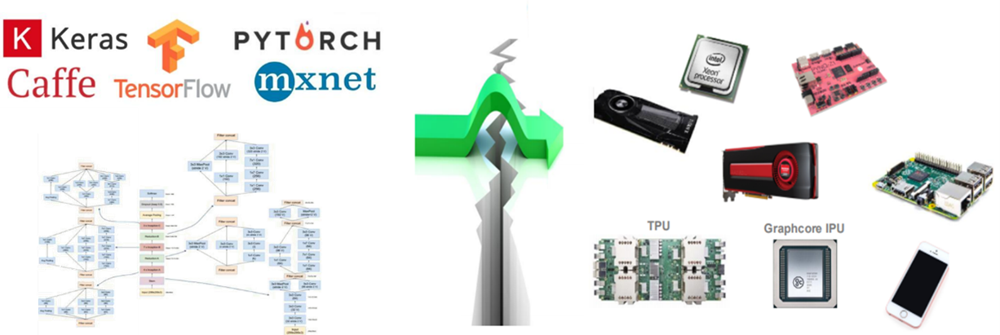
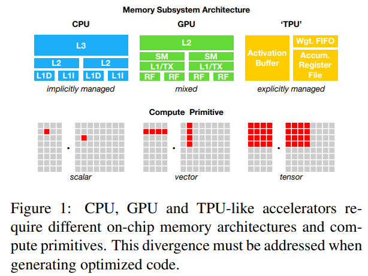
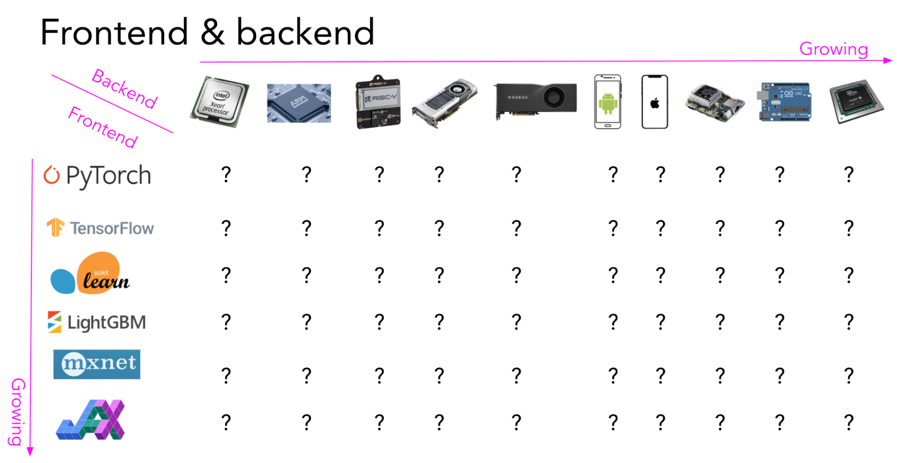
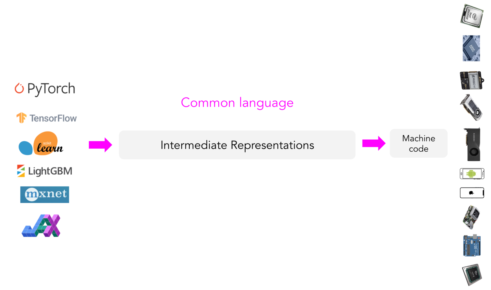
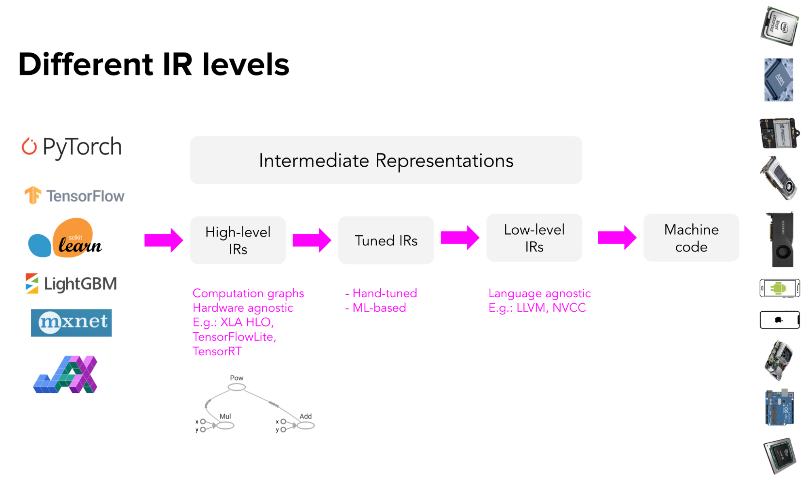
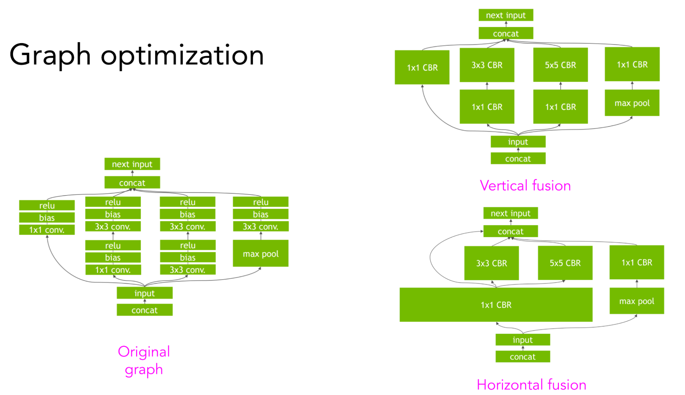
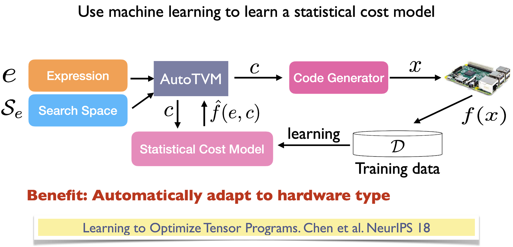

# 编译器：过去，现在与未来

参考链接：

- [COMPILING HISTORY TO UNDERSTAND THE FUTURE](https://www.nextplatform.com/2018/11/02/compiling-history-to-understand-the-future/)


# 1. 第一个编译器是怎么来的

首先我们针对C语言，讲讲C语言的第一个编译器是怎么构建的，有了C语言的编译器，就可以构建任何其它语言。比如Python底层就可以通过C来实现，叫做CPython。至于C++，之后再说。


## 1.1 C语言的历史

在讲第一个C语言编译器之前，了解C语言的历史有助于我们更好地了解第一个C编译器是怎么构建的。

C语言之父[Dennis Ritchie](https://en.wikipedia.org/wiki/Dennis_Ritchie)在[The Development of the C Language*](https://www.bell-labs.com/usr/dmr/www/chist.html)中介绍了C语言的发展历程。


C语言的发展大致可以分为几个时期：

1. 1969-1973 C语言作为Unix的实现语言，一起形成。
2. 1977-1979 Unix的可移植性被提出；对于C语言的详细描述与介绍也被提出，这本书就是现在广为人知的***The C Programming Language***，被称作白皮书(也被称作C语言的圣经)，作者为[Brian Kernighan](https://en.wikipedia.org/wiki/Brian_Kernighan)与[Dennis Ritchie](https://en.wikipedia.org/wiki/Dennis_Ritchie)，简称**K&R**。
3. 1980s C语言被标准化


### 1.1.1 History: the setting

1960s这一时期对于贝尔实验室计算机系统研究来说是一个动荡的时代。贝尔实验室先前与通用电气，MIT一同研发名为Multics的系统，[Multics]()。但是贝尔实验室后续认为这个项目进度落后并且过于昂贵，因此退出了这个项目。甚至是在贝尔实验室退出这个项目之前，就已经开始由一个[Ken Thompson]()领导的小组着手研发Multics的替代品。


Ken Thompson研发的这个系统，背后有许多Multics系统的影子：进程的概念，树结构的文件系统，命令解释器(command interpreter)作为user-level program，文本文件的简单表示以及对于设备的统一访问方式。这些都是Multics系统的创新点。但同时也剔除了一部分Multics的特性，比如**Multics中访问内存与访问文件的方式是统一的**。并且在项目的最开始，Thompson也并没有考虑Multics系统的另一个重大特性，即整个Multics系统都是只用高级语言编写的，这个高级语言是PL/I。但是由于PL/I并不是特别符合Thompson等人的口味，因此没有采用。但是也尝试了别的语言，包括[BCPL]()。采用高级语言带来的好处是显而易见的：编写起来更简单，理解起来更容易。并且在那个时期，系统的开发并没有考虑到系统的移植性，这一点在后续的发展中才逐渐引起人们的重视。


Thompson当时面对的硬件环境是比较简陋的：DEC PDP-7，8K 18-bit words的内存并且没有一些可用的软件。因此为了能够使用高级语言，Thompson用PDP-7的汇编语言编写了一个Unix的原始版本。但即使是这个PDP-7汇编版本的Unix，也并不是在PDP-7上编写的，而是利用GE-635机器上的GEMAP汇编器的一组macros编写，再由postprocessor的程序产生PDP-7可读的paper tapes(也就是过去用的打孔纸片)。


这些tapes被转移到PDP-7上，实现了一个Unix kernel，editor，assembler，simple shell(command interpreter)以及一些其它工具(Unix rm，cat，cp等命令)。这些东西完成之后，这个原始Unix操作系统就成了一个自举(self-supporting)的系统，在PDP-7上编写程序不再需要paper tape了，开发就转移到了PDP-7上。


Thompson的PDP-7汇编器在简单性方面甚至超越了DEC原生的汇编器。Thompson的汇编器分析表达式，并且将其转变为相应的0/1串(也就是机器码)。但是那时候的运行环境没有libraries，没有linker，也没有loader，整个源程序直接交给assembler处理，输出的可执行文件只有一个固定的名字(这个固定的名字就是`a.out`，这也是现在的*nix系统中，一些可执行的文件的名为`a.out`的由来，`a`代表`assembler`，就是代表assembler的输出。即使在后续系统有了linker，并且有了另一套显式命名的方法，`a.out`这个名字还是被保留为编译器产生的默认的可执行文件的文件名)。


1969年，Unix第一次在PDP-7上运行。不久之后，[Doug McIlroy]()创建了适用于这个新系统的第一个高级语言：[McClure]()'s TMG的一种实现。TMG(全称TransMoGrifiers)，是一种用于编写编译器的语言，采用自顶向下，递归下降的方式，结合上下文无关文法与[procedural elements]()。McIlroy与Bob Morris使用TMG为Multic编写了一个PL/I编译器的早期版本。


在看到了McIlroy对TMG的实现这一壮举之后，Thompson决定Unix(那个时候可能还并没有对这个系统命名为Unix)需要一个系统编程语言。最开始尝试使用Fortran，但是很快就失败了。因此Thompson决定自己创建一个语言，用以辅助Unix，称之为B语言。B语言可以被认为了无类型的C语言版本；更加精确的说法，B语言是BCPL语言压缩到8K bytes内存，并且经过Thompson取舍与设计的一种语言。B语言被叫做`B`也大概是因为其是BCPL语言的一个压缩版本，但也有说法为B语言来自于Bon。Bon是Thompson在Multics项目中工作的时候创建的语言。Bon这个名字的起源也有两种说法，第一种是以Thompson的妻子Bonnie命名，第二种说法是Bon这个名字源自于宗教。


### 1.1.2 Origins: the languages

BCPL语言由Martin Richards于1960s中期，在他访问MIT时设计。BCPL在1970s早期在许多非常有意思的项目中被使用：Oxford的OS6操作系统，Xerox PARC研究所的Alto系统。MIT的CTSS系统被用于Multics的开发，而Richards的BCPL工作正是在CTSS系统上进行的，因此贝尔实验室的研究人员对于BCPL这门语言非常熟悉。BCPL编译器被Rudd Canaday以及其它贝尔实验室的研究人员移植到了Multics以及GE-635 GECOS系统上。

在贝尔实验室推出Multics项目前的最后一段时间以及之后的一段时间，BCPL是后续参与到Unix项目中的一些研发人员使用的语言。


无论BCPL，B还是C，都是以Fortran与Algol 60为代表的传统的过程性语言。它们都面向系统编程，精简、描述紧凑并且能够用简单的编译器编译。


但是BCPL，B以及C在一些句法上的细节有区别，但是从广义上来讲，它们非常相似。

### 1.1.3 More History


# Multics Project


# 2. Compiling History To Understand The Future

参考链接：

- [COMPILING HISTORY TO UNDERSTAND THE FUTURE](https://www.nextplatform.com/2018/11/02/compiling-history-to-understand-the-future/)

这篇文章总结了编译器在过去五个十年中的发展，了解过去在能更好地理解现在以及未来的发展。


# AI compiler

翻译自[A friendly introduction to machine learning compilers and optimizers](https://huyenchip.com/2021/09/07/a-friendly-introduction-to-machine-learning-compilers-and-optimizers.html)

AI compiler有许多叫法，也可以叫ML compiler，DL compiler，NN compiler。

## .1 

AI Compilers的一个主要的目的就是为了`bridging the gap between ML models and hardware accelerations`。更具体地来说，就是为了解决模型在不同硬件上部署问题：兼容性(Compatibility)与性能(Performance)。



## .2 Compatibility

对于一个模型，往往需要在不同的硬件平台上部署与运行，现在能够部署模型的目标平台有许许多多，Intel CPU/Nvidia GPU/Intel GPU/Arm CPU/Arm GPU/FPGA/NPU(华为海思)/BPU(地平线)/MLU(寒武纪)。如何使得一个任意框架的模型(Torch或TensorFlow......)能够运行在任意的目标平台上，这就是Compatibility需要考虑的问题。而如何使得模型部署在目标平台之后，仍然能够保持性能，就是Performance需要考虑的问题。


DL framework如果想在某一种类的硬件(平台)上运行，是需要硬件厂商提供相应的支持的。这一部分的工作工程性非常强并且耗时，需要程序员对于底层硬件有深入的认知。不同的硬件有着不同的特性，具体体现在不同的memory layout，不同的compute primitives。



CPU的compute primitives是scalar，GPU是1维vector，TPU是二维vector(tensor)。现在，许多CPU也有vector instruction，GPU也有**tensor cores**。因此在这些不同的硬件上，如果想实现一个在256x3x256x256上的convolution，实现的方式是非常不一样的。并且，这些不同硬件有着不同的L1，L2以及L3缓存的layout，如何利用好这些缓存以加速性能的方式也是不同的。


正是由于不同硬件的巨大差异，所以DL framework开发者更加倾向于对于部分硬件提供支持。同时硬件制造商也倾向于对于部分DL framework提供核心库(kernel libraries，也就是我们常说的算子库)支持(比如Intel提供了**OpenVINO**，用以支持Caffe, TensorFlow, MXNet, Kaldi, and ONNX)；NVIDIA提供了CUDA与cuDNN。所以如果需要将模型部署到新的硬件上需要非常大的工程量。

并且新的DL framework以及新的硬件也在不断涌现，如何为这些新的DL framework以及新的硬件提供支持，就是一大难题。因为光是为一种DL framework以及一种硬件提供支持就已经是一件非常麻烦的事情。




这一点与传统的compiler面临的问题是相似的，新的编程语言不断涌现，新的硬件也在不断涌现，对于每一种语言与硬件组成的二元组
$$
(Programming\ Language, target\ hardware)
$$
我们都需要编写一个编译器，这样的工作量显然是非常巨大的。

而**LLVM**就是为了解决这样的问题。**LLVM**通过引入一个IR，通过复用IR减轻编译器开发时的工作量。


从这一点我们也能够理解为什么叫做AI compiler。与传统的compiler面临的问题相似，我有n个语言，m个目标平台。为了编写这n个语言在m个平台的编译器，我们需要编写n x m个编译器，这些过程中大部分工作都是重复的。因此通过引入一个中间表示IR，只需要为n个语言编写n个转化成IR的前端，再为m个目标平台编写m个转化为目标平台代码的后端，n + m的工作量就可以完成任务。这种思想同样应用于AI compiler中，我有n个**训练框架**，m个目标平台(或者叫做**推理框架/推理引擎**)，通过引入一个中间表示IR，重用IR部分的代码，减轻工作量。

因此对于AI compiler来说，其编程语言就是不同训练框架训练出的模型(compiler前端)，而目标平台代码就是不同推理引擎下的代码(compiler后端)。


AI compiler采用了相同的策略，引入了一个中间表示IR，并且利用了**LLVM**来完成从IR到machine code的code generation的过程。

```
TensorFlow XLA, NVIDIA CUDA compiler (NVCC), MLIR (a meta-compiler that is used to build other compilers), and TVM all use LLVM.
```




上面的这个过程也叫做**lowering**。

对于AI compiler，High-level IRs一般是计算图，并且是hardware-agnostic(并不知晓硬件的特性)；而Low-level IRs是framework-agnostic(并不知晓DL framework的特性)。




## .3 Performance

当模型能够在目标平台上跑起来之后，另一个问题也随之而来，就是如何保证性能。从IR codegen而来的machine code可能并不想原始的模型一样表现那么好，可能并没有充分利用到硬件的特性以及data locality，也可能并没有利用到一些向量化或者并行的策略。

一般来说，DL的workflow会使用到许多不同的framework以及libraries，比如使用pandas/dask/ray抽取数据的一些metadata，使用NumPy进行向量化，采用各种各样的ML framework(sklearn，TensorFlow以及PyTorch)。通常来说，这些库函数是充分被优化的。但是一旦涉及到不同库之间的操作，优化不是很理想(基本不存在优化)。

因此AI compiler还需要兼顾对于模型的优化。

总结下来，AI compiler包括两方面**lowering**与**optimization**。


## .4 Compiler优化方式

ML模型的两种优化方式：**locally与globally**。

**locally**优化侧重于优化单个或者多个算子；**globally**优化侧重于优化整个计算图。


locally优化主要是通过并行或者减少访存实现优化：

- **vectorization**
- **parallelization**
- **loop tiling**
- **operator fusion**


上面这些优化只能够带来3x的加速，如果想要更好地优化还需要**globally**的优化，从计算图上优化。

通过对于一个计算图垂直与水平方向的fusion(算子融合)，减少访存的同时加速模型。




## .5 如何找到最佳的优化方式

从上面可以看到，优化的方式有许多，但是如何在众多的优化方式中找到最佳的一套组合时需要考虑的问题。

寻找最佳的优化方式可以分为两种**Hand-designed与ML-based compilers**

### .5.1 Hand-designed rules

Hand-designed方式需要由optimization engineers根据经验以及一些启发式算法从而找到一个快速执行一个模型的计算图的方式。但是这种方式往往不是最优的，并且non-adaptive，兼容性不太强，往往一种优化方式难以迁移到另一个DL framework以及hardware上。


并且，不同的模型结构有着不同的计算图，使用到的算子也是不同的。优化CNN的方式，优化RNN的方式以及优化Transformer，由于三种模型的计算图中的算子不同，优化方式也必然不同。对于一些热门的模型结构(ResNet，Bert)，硬件厂商会专门在硬件上对其进行优化。

### .5.2 Using ML to speed up ML models

如何找到计算一个计算图的最佳路径。一种方式是我们枚举出所有的可能，从其中找到运行时间最短的一种方式，但是情况太多无法不肯能实现。


另一种方式就是利用ML：

- 减小搜索空间
- 能够预测每一种执行顺序花费的时间，从而不需要真正执行一遍计算图

但是对于第二点预测计算图的执行时间，是很难做到的，通常需要作出非常多的假设。但是对于计算图中的一个小子图或者一个算子，还是能够做到的。这一方面有两个比较有代表性的技术：**cuDNN autotune**与**autoTVM**

#### .5.3.1 cuDNN autotune

cuDNN autotune会在一组预先定义好的执行卷积算子的选项中进行搜索，然后找到最快的方式。因此当多次迭代同一个卷积网络时，最开始执行会很慢，但是随着cuDNN autotune找到了最佳的执行策略，后续执行会逐渐加速。


但是cuDNN局限性也非常强，只适用于卷积算子，并且只在PyTorch以及MXNet中适用。

#### .5.3.2 autoTVM

autoTVM相比于cuDNN autotune，是一个更通用的解决方案。相比于cuDNN autotune只对于卷积算子进行优化，autoTVM的优化对象是一个子图，因此相比于cuDNN autotune，autoTVM的工作方式更加复杂：

1. 首先TVM将计算图分割成许多子图
2. 预测每一个子图的大小
3. 对于每一个子图，搜索最佳的执行策略
4. 把每一个子图的最优执行策略串成一个对整个计算图的执行策略


TVM中引入了一个cost model。

```
autoTVM measures the actual time it takes to run each path it goes down, which gives it ground truth data to train a cost model to predict how long a future path will take. 
```




类似于TVM这样的AI compilers能够做到adaptive，flexible和useful。DANSH

但是，尽管auto tuning的结果非常好，但是TVM非常慢。TVM需要在所有的可能策略中找到最优的，对于复杂的ML model这个过程可能会花费数小时甚至是数天的时间。但是，一旦TVM找到了一个最优策略，这个策略可以被缓存下来，既可以作为优化现有模型的策略，也可以作为一个未来的一个搜索session的一个start point。


autoTVM的工作方式详见：

- [TVM: An Automated End-to-End Optimizing Compiler for Deep Learning](https://arxiv.org/pdf/1802.04799)
- [Apache TVM](https://tvm.hyper.ai/docs/how_to/autotune/)


## .6 不同种类的AI compilers

domain-specific compilers是最为广泛使用的一种AI compiler，这一类的compiler面向的是一套固定的DL framework以及固定的硬件，比如：

- **NVCC(NVIDIA CUDA Compiler)**
- **XLA(Accelerated Linear Algebra, Google)**：最初是用于加速TensorFlow模型，现在被JAX采用
- **PyTorch Glow (Facebook)**：PyTorch采用XLA使得PyTorch模型能在TPU上运行，对于其他硬件，采用PyTorch Glow


除此之外，还有一些第三方的compiler:

- **Apache TVM**
- **MLIR**：真正意义上来说MLIR并不是一个compiler，而是一个meta compiler，MLIR于LLVM类似，是一个compiler infrastructure，允许使用MLIR来构建自己的compiler。


**WebAssembly(Wasm)**


利用sklearn，PyTorch，TensorFlow等框架训练好模型之后，利用AI compiler将其编译为WASM，使得模型能够在浏览器内运行。但是WASM目前最大的问题还是slow。


## .7 AI compiler的未来

尽管AI compiler引入IR，但是目前不同DL framework(PyTorch，TensorFlow)采用的IR是不同的，目前还没有找到一个统一的IR。

```
Even though there has been huge progress in compilers for machine learning, there’s still a lot of work to be done before we can abstract compilers completely from general ML practitioners.
```

