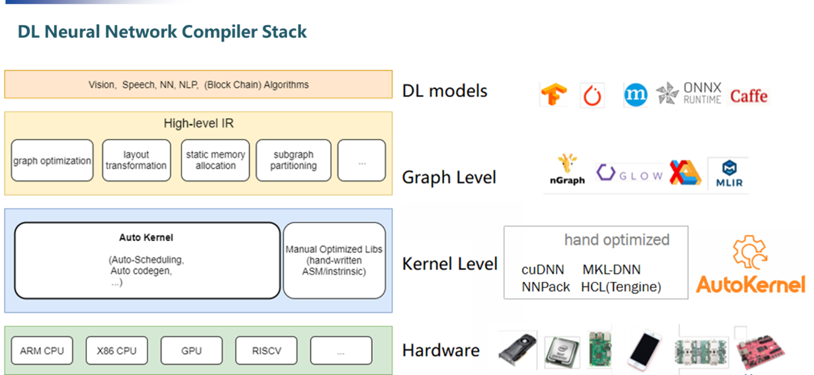
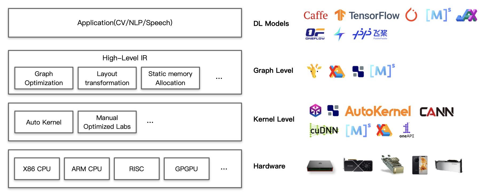
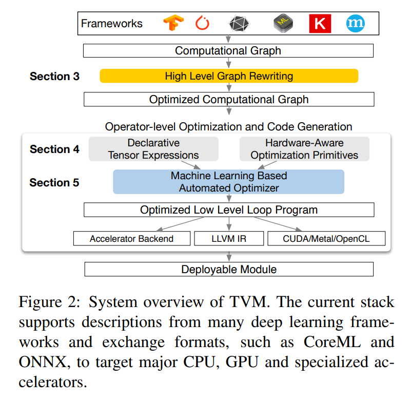

# 1. flex(lex)

flex的前身是lex，flex是lex的开源实现版本，意为fast lexical analyzer。

正则表达式 --> NFA --> DFA --> 最简DFA --> 词法分析器


## 1.1 flex描述文件构成

一个flex描述文件`.l`的结构如下：

```
definitions
%%
rules
%%
user code
```

包括三个部分，definitions，rules与user code

### 1.1.1 definitions section


## 1.2 flex的工作流程

flex接收到输入文件`.l`之后，会输出一个`lex.cc.c`文件，这个`.c`文件就实现了词法分析器。其中的核心函数就是`yylex()`，除此之外还包括许多tabes(用于匹配tokens)，一些辅助函数以及宏定义。


# 2. bison(yacc)

yacc(Yet Another Compiler Compiler)，一个parser generator

BSD与Unix采用的是yacc，而GNU-based Linux采用的是bison，一个yacc的替代版本。


Unix下：lex + yacc

GNU Linux下：flex + bison


bison生成的parser采用的是LALR(1)文法进行分析，因此当bison描述文件中的文法中存在shift/reduce或者reduce/reduce冲突时，bison会报错。

## 2.1 bison描述文件构成

bison `.y`文件大致分为4个部分：

```
%{
  Prologue
%}

Bison declarations

%%
Grammar rules
%%

Epilogue
```

### 2.1.1 The prologue

```
The Prologue section contains macro definitions and declarations of functions and variables that are used in the actions in the grammar rules.
```

这一部分将会被完整的拷贝到实现parser的源代码(.c/.cpp)文件的开头。

可以有多个prologue section，与Bison declarations交叉，`This allows you to have C and Bison declarations that refer to each other`。

```bison
%{
  #define _GNU_SOURCE
  #include <stdio.h>
  #include "ptypes.h"
%}

%union {
  long n;
  tree t;  /* tree is defined in ptypes.h. */
}

%{
  static void print_token (yytoken_kind_t token, YYSTYPE val);
%}

…
```


### 2.1.2 The Bison Declarations Section

```
The Bison declarations section contains declarations that define terminal and nonterminal symbols, specify precedence, and so on.
```

这一部分通过**Bison declarations**定义了终结符与非终结符，并且确定了优先级。

```
The Bison declarations section of a Bison grammar defines the symbols used in formulating the grammar and the data types of semantic values.
All token kind names (but not single-character literal tokens such as '+' and '*') must be declared. Nonterminal symbols must be declared if you need to specify which data type to use for the semantic value.
```

#### 2.1.2.1 Token Kind Names

声明一个token kind name

```
%token name
```

Bison会将其转变为parser中的一个类似于宏定义的东西，通过这个name以一种更加便于记忆的方式，替换掉这个token的kind code(应该是一个整数)。

因此还可以显示地指定一个token的kind code

```
%token NUM 300
%token XNUM 0x12d // a GNU extension
```

如果不指定的话，Bison会自己选择该token kind的numeric code。

```
Bison will automatically select codes that don’t conflict with each other or with normal characters.
```

通过以下方式指定token的data type

```
%token <type> name
```

这个type涉及到一个`YYSTYPE`类型的全局变量`yylval`。

`YYSTYPE`用以标明语义值的类型，`YYSTYPE`是一个宏，用户可以自己定义`YYSTYPE`的类型，比如说

```c
#define YYSTYPE double
```

`YYSTYPE`默认的类型为`int`。

除了`YYSTYPE`之外，`%union`也可以用于指定语义值的类型，但是`%union`是用于`specifies the entire collection of possible data types for semantic values`，声明一系列可能会用到的语义值的类型。

```
%union {
  double val;
  symrec *tptr;
}
```

也可以是以下的格式

```
%union value {
  double val;
  symrec *tptr;
}
```

如果指定的vlaue，那么这一条declaration相当于C语言的`union value`

如果不指定value的话，这个value的默认值就是`YYSTYPE`

`%union`这一条声明，会被bison转变为C语言中的一个union类型，其中这个类型的类型名为`union value`(如果没有指定value，那么这个value默认采用YYSTYPE作为union的类型名)。

对于一个token，其语义值将会被存储到`yylval`这一个全局变量之中，其是一个`YYSTYPE`类型的变量。

bison通过`yylval`全局变量将语义值传给token，具体的传值过程涉及到`yylex`函数，这个函数可以由flex根据flex输入文件自动产生，参考[flex的工作流程](#1.2-flex的工作流程)


### 2.1.3 Grammar Rules


### 2.1.4 Language Semantics

为了描述语义信息，bison受限需要定义好不同语义值的类型，有两种方式，这两种方式是等效的。

**第一种方式**

```
%define api.value.type union
%token <int> INT "integer"
%token <int> 'n'
%nterm <int> expr
%token <char const *> ID "identifier"
```

bison产生的对应.c文件的内容为

```c
/* Value type.  */
#if ! defined YYSTYPE && ! defined YYSTYPE_IS_DECLARED
union YYSTYPE
{
  char const * ID;                         /* "identifier"  */
  int INT;                                 /* "integer"  */
  int yykind_4;                            /* 'n'  */
  int expr;                                /* expr  */

#line 73 "test.tab.h"

};
typedef union YYSTYPE YYSTYPE;
# define YYSTYPE_IS_TRIVIAL 1
# define YYSTYPE_IS_DECLARED 1
#endif


extern YYSTYPE yylval;
```

**第二种方式**

```
%union {
	int INT;
	char const* ID;
	int expr;
	int yykind_4;
}
```


因此`yylval`这个全局变量实际上就是一个联合体，存储着语义值，根据不同token的类型，从而有不同的数据类型，然后就可以通过访问和修改`yylval`的内容，实现语义计算。

```c
/* For an "integer". */
yylval.INT = 42;
return INT;

/* For an 'n', also declared as int. */
*((int*)&yylval) = 42;
return 'n';

/* For an "identifier". */
yylval.ID = "42";
return ID;
```

对于bison来说，其语义动作就是C代码。C代码访问bison中符号(终结符/非终结符)是通过形如`$n`(或者`$name`/`$[name]`)的结构访问的。对于语义动作中出现的`$n`/`$name`/`$[name]`，bison会将其转译为正确的C表达式。

```
exp:
…
| exp '+' exp     { $$ = $1 + $3; }
```

或者

```
exp[result]:
…
| exp[left] '+' exp[right]  { $result = $left + $right; }
```

bison转换成的C代码实际上就是通过对`yylval`进行赋值等操作计算出语义信息。


# 3. flex与bison协同


# 4. 第一个编译器


# 5. NN Compiler

## 5.1 NN Compiler Stack




NN Compiler的顶层是DL Framework：TensorFlow，Caffe，PyTorch，Mxnet，ONNX等等。

Graph level是High-level IR，High-level IR一般都是计算图，通过计算图描述NN的结构。这一层是hardware-agnostic的。

Kernel level(Operator level算子层)，这一层主要涉及到tensor计算。为了实现高效率的计算，硬件厂商都会提供配套的优化好了的算子库，比如Intel的**MKL**，NVIDIA的**cuDNN**与**TensorRT**。这些算子库是高度手工优化的；还有一种方法就是自动化生成算子，TVM采用了这种做法，在众多计算策略中自动找到最优的一种策略。

这一层是framework-agnostic的。

最底层就是底层的硬件：CPU，GPU，TPU，NPU......


## 5.2 Operator算子

关于算子的介绍，[这里](../模型部署笔记/模型部署.md)




## 5.3 一些NN Compiler


### 5.3.1 TVM



### 5.3.2 XLA(Accelerated Linear Algebra)


### 5.3.3 MLIR(**M**ulti-**L**evel **I**ntermediate **R**epresentation)

```
MLIR: A new intermediate representation and compiler framework
```

整个TensorFlow框架包含了许多compilers以及optimizers，这些不同的compiler以及optimizer工作在software stack以及hardware stack的不同层级上。构成了一个multi-level stack的结构。


对于一个TensorFlow Graph，可以以许多种方式被运行：

1. Sending them to the TensorFlow executor that invokes hand-written op-kernels

   

2. Converting them to [XLA](https://www.tensorflow.org/xla/overview) High-Level Optimizer representation (XLA HLO), which in turn can invoke the [LLVM](https://llvm.org/) compiler for CPU or GPU, or else continue to use XLA for [TPU](https://cloud.google.com/tpu/). (Or some combination of the two!)

   

3. Converting them to [TensorRT](https://developer.nvidia.com/tensorrt), [nGraph](http://ngraph.nervanasys.com/index.html/), or another compiler format for a hardware-specific instruction set

   

4. Converting graphs to [TensorFlow Lite](https://www.tensorflow.org/lite) format, which is then executed inside the TensorFlow Lite runtime, or else further converted to run on GPUs or DSPs via the [Android Neural Networks API (NNAPI)](https://developer.android.com/ndk/guides/neuralnetworks) or related tech.


除此之外，在每一个Layer中，还会有多轮优化，比如**Grappler**框架。

但是这些不同的compiler以及不同的IR会带来一些弊端：

1. ```
   在中间表示的转换过程中，各个层级的中间表示各自为政，无法互相有效地沟通信息，也不清楚其他层级的中间表示做了哪些优化，因此每个中间表示只能尽力将当前的优化做到最好，造成了很多优化在每个层级的中间表示中重复进行, 从而导致优化效率的低下。尤其是从图中间表示到SSA中间表示的变化过大，转换开销极大。此外，各个层级的相同优化的代码无法复用，也降低了开发效率。
   new hardware and software stack creators must rebuild optimization and transformation passes for each new path.
   ```

2. ```
   this heterogeneous world can cause issues for end users, such as producing confusing error messages at the boundary between these systems.
   ```


而MLIR就是为了解决上面的问题。MLIR既是一类IR格式，同时也是一系列compiler utilities的集合。

```
MLIR不是一种具体的中间表示定义，而是为中间表示提供一个统一的抽象表达和概念。 开发者可以使用MLIR开发的一系列基础设施，来定义符合自己需求的中间表示， 因此我们可以把MLIR理解为“编译器的编译器”。MLIR不局限于TensorFlow框架， 还可以用于构建连接其他语言与后端（如LLVM）的中间表示。 MLIR深受LLVM设计理念的影响，但与LLVM不同的是， MLIR是一个更开放的生态系统。 在MLIR中， 没有预设的操作与抽象类型， 这使得开发者可以更自由地定义中间表示，并更有针对性地解决其领域的问题。
```


**MLIR Dialects**包括：

- TensorFlow IR, which represents all things possible in TensorFlow graphs

  

- XLA HLO IR, which is designed to take advantage of XLA’s compilation abilities (with output to, among other things, TPUs)

  

- An experimental affine dialect, which focuses on [polyhedral representations](https://en.wikipedia.org/wiki/Polytope_model) and optimizations

  

- LLVM IR, which has a 1:1 mapping between it and LLVM’s own representation, allowing MLIR to emit GPU and CPU code through LLVM

  

- TensorFlow Lite, which will translate to running code on mobile platforms


# 6. ANTLR


# 7. CPython

CPython是Python的一个reference implementation，采用C与Python混合编写。


# 8. Parser技术

参考文章：

- [LL and LR in Context: Why Parsing Tools Are Hard](https://blog.reverberate.org/2013/09/ll-and-lr-in-context-why-parsing-tools.html)


## 8.1 Theory vs. Practice

过去的一些年间，一直不断有与parsing和language theory相关的理论与paper被提出。从最早由Knuth在[On the Translation of Languages from Left to Right](http://www.cs.dartmouth.edu/~mckeeman/cs48/mxcom/doc/knuth65.pdf)中提出的LR(k)文法到现在，在parsing与language theory领域中，mathematically-oriented papers一直在被提出。[Parsing Techniques: A Practical Guide](http://dickgrune.com/Books/PTAPG_2nd_Edition/)是一个对于该领域比较好的综述，在其附录中就引用了超过1700篇论文。但是只有很少一部分理论应用于实际。大部分项目依然选择不依赖于任何形式化工具，手写parser。

语言的语法一般通过形式化方法定义(比如BNF)，但是实际上并不能从一个形式化的表述方法直接得到一个真实的parser。[GCC moved *away* from their Bison-based parser to a handwritten recursive descent parser](http://gcc.gnu.org/wiki/New_C_Parser). [So did Go](https://www.reddit.com/r/golang/comments/46bd5h/ama_we_are_the_go_contributors_ask_us_anything/d03zx6f).但是还是有一些选择使用Bison，比如Ruby与PHP。

这就造成了理论与实际的巨大差异。Why？


真实世界中的许多文法都不是LL或者LR的。这也是为什么两种最著名的LL和LR parsing工具(ANTLR与bison)在纯LL与LR的parsing算法上做了拓展，增添了一些特性(operator precedence, syntactic/semantic predicates, optional backtracking, and generalized parsing)。

但是尽管这些工具经过了拓展，但是仍然无法解决某些问题。并且这些工具仍然在不断被改进，以解决一直以来的parser generator的一个痛点[traditional pain points of parser generators](http://mortoray.com/2012/07/20/why-i-dont-use-a-parser-generator/)。ANTLR4相比于ANTLR3完全修改了其的parsing算法，来提升其易用性，新的parsing算法叫做[ALL(*)](http://antlr.org/papers/allstar-techreport.pdf)。而Bison采用[IELR](http://people.cs.clemson.edu/~malloy/papers/sac08/paper.pdf)来替代LALR，以此来增加Bison能够处理的文法数量，并且更加高效地parsing。

同时也有LL/LR分析的替代，比如**PEGs(Parsing Expression Grammars)**，尝试从一个完全不同的角度解决这些pain points。


但是这并不意味着LL与LR过时了。


LL与LR parser的优势在于它们是效率最高的parsing算法。


## 8.2 Clarifying “LL parser” and “LR parser”

LL parser与LR parser并不是指一种算法，而是指一大类算法。在这个大类下面，有一些具体的LL和LR算法，比如LR(k)，LALR(1)，SLR，LL(*)。


## 8.3 Context-Free Grammars: powerful, but not all-powerful


## 8.4 Ambiguity in CFGs

首先是编译原理中文法二异性的定义，这里不再赘述。


# 关于Compiler-Compiler(Compiler Generator)的一些思考与总结


# 关于Syntax analysis与Semantic analysis


# 关于Programming Language与Compiler(Intepreter)


# 自举(Bootstrapping)，他举与加拿大编译


## T-diagrams

T型图(**tombstone diagrams**)


通过T型图的组合，可以描述编译器的自举过程([bootstrapping](https://en.wikipedia.org/wiki/Bootstrapping_(compilers)))，语言的移植([porting](https://en.wikipedia.org/wiki/Porting))以及[self-compiling](https://en.wikipedia.org/wiki/Self-hosting_(compilers))的过程。


## chicken-or-egg problem in compiler design

在自举之前


## **自举([bootstrapping](https://en.wikipedia.org/wiki/Bootstrapping_(compilers)))**

```
In computer science, bootstrapping is the technique for producing a self-compiling compiler – that is, a compiler (or assembler) written in the source programming language that it intends to compile.
```


下面是利用T型图描述C编译器的自举过程：

1. 首先用C语言编写一个C语言的编译器(左边的T型图)
2. 然后用机器语言编写的C语言编译器，将左边的C语言形式的编译器编译，就得到了一个新的机器语言编写的C语言的编译器


- PGI
- CAPS
- Cray
- OpenACC
- Open64
- SUIF
- Zephyr
- IMPACT(*Illinois* *Microarchitecture* *Project using* *Algorithms and* *Compiler* *Technology*)
