# 1. CPU


## 1.1 Architecture Microarchitecture And Implementation

这三者是不同的概念，但是互有联系，右图出自[arm](https://www.arm.com/architecture/cpu)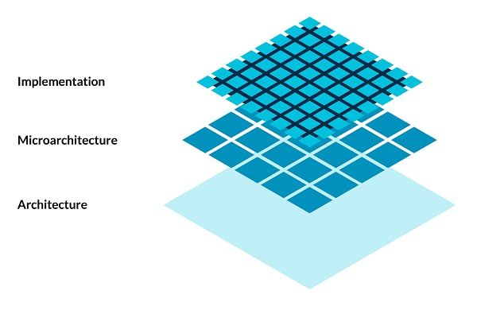

```
The Arm CPU architecture is implemented by a wide range of microarchitectures to deliver software compatibility across a broad range of power, performance, and area points.

- The CPU architecture defines the basic instruction set, and the exception and memory models that are relied on by the operating system and hypervisor.
- The CPU microarchitecture determines how an implementation meets the architectural contract by defining the design of the processor and covering such things as: power, performance, area, pipeline length, and levels of cache.
```

Microarchitecture是对于Architecture的实现，对于同一个Architecture可以有多个Microarchitecture实现。这里的Architecture一般是指ISA(Instruction Set Architecture)。


更加广义的Computer Architecture包含一下几个方面：

- **[Instruction Set Architecture](https://en.wikipedia.org/wiki/Instruction_set_architecture)**
- **[Microarchitecture](https://en.wikipedia.org/wiki/Microarchitecture)**
- **[Systems design](https://en.wikipedia.org/wiki/Systems_design)**


wiki官方对于Computer architecture的一些理解：

- It can sometimes be a high-level description that ignores details of the implementation.[[2\]](https://en.wikipedia.org/wiki/Computer_architecture#cite_note-2) At a more detailed level, the description may include the [instruction set architecture](https://en.wikipedia.org/wiki/Instruction_set_architecture) design, [microarchitecture](https://en.wikipedia.org/wiki/Microarchitecture) design, [logic design](https://en.wikipedia.org/wiki/Logic_design), and [implementation](https://en.wikipedia.org/wiki/Implementation).[[3\]](https://en.wikipedia.org/wiki/Computer_architecture#cite_note-3)


### 1.2 Instruction Set Architecture

### 1.2.1 Classification of ISAs

按照架构的复杂性分类：

- **CISC** 更多的[specialized instructions]()，只不过这些指令很少被使用，一般一些专业软件会使用到这些指令
- **RISC** 对于一些经常被使用的指令高效实现，对于复杂但是不常用的指令，通过[subroutine]()实现(加速经常性事件[**Amdahl's law**](https://en.wikipedia.org/wiki/Amdahl%27s_law))

还有一些其它的ISA，比如VLIW([very long instruction word](https://en.wikipedia.org/wiki/Very_long_instruction_word))，EPIC(*[explicitly parallel instruction computing](https://en.wikipedia.org/wiki/Explicitly_parallel_instruction_computing)*)。

- These architectures seek to exploit [**instruction-level parallelism**](https://en.wikipedia.org/wiki/Instruction-level_parallelism) with less hardware than RISC and CISC by making the [compiler](https://en.wikipedia.org/wiki/Compiler) responsible for instruction issue and scheduling.[[4\]](https://en.wikipedia.org/wiki/Instruction_set_architecture#cite_note-4)


但是也有一些比RISC更加精简的ISA，但是目前只存在于理论，MISC([minimal instruction set computer](https://en.wikipedia.org/wiki/Minimal_instruction_set_computer))与OISC([one-instruction set computer](https://en.wikipedia.org/wiki/One-instruction_set_computer))。


对于一些ISAs，在其基础上还有一些指令集的拓展[Instruction set](https://en.wikipedia.org/wiki/Instruction_set) [extensions](https://en.wikipedia.org/wiki/Processor_supplementary_capability)

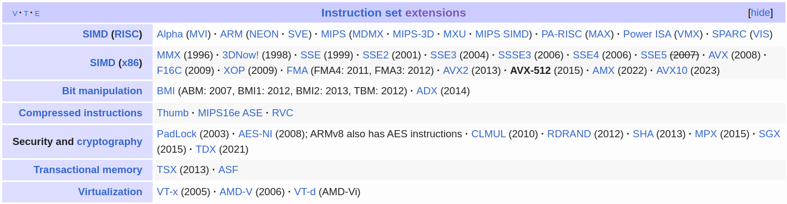


CISC：x86 familiy

RISC：arm，RISC-V，mips，PowerPC

VLIW：IA-64

### 1.2.2 Instruction set implementation

这一部分就是[Microarchitecture](#1.3-Microarchitecture)


### 1.2.3 machine code

assembly language与numerical machine code都是machine code，只不过表现形式不同。assembly language采用助记号的形式，方便阅读；而numerical machine code就是纯0/1序列。二者之间通过**汇编器**转换。

ISA与machine code并不是一个概念，machine code是0/1的序列，而ISA是诸如`add`等的汇编指令。

早期的CPU，不同的CPU都有专门的machine code，因此新的无法做到向后兼容。而通过引入ISA，作为一个abstraction layer，规定了一套指令集的行为以及编码规则，**不关心具体的实现**。从而使得同一系列的CPUs能够相互兼容。


比如对于RISC-V指令集，其每一条指令长度固定为32bit，不同指令的编码也不同，其具体的行为也不同。这些就是ISA规定的内容。

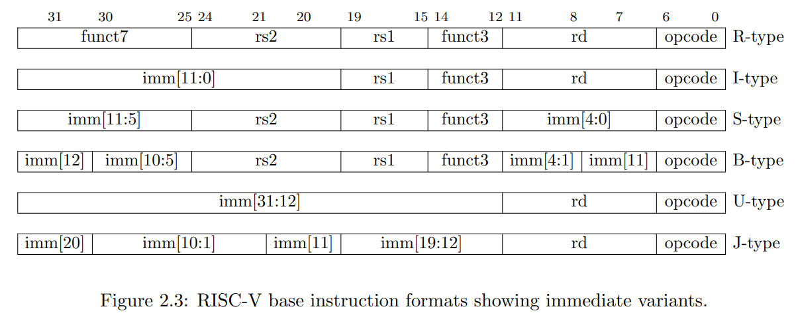

只要CPU是同一个ISA，那么对于同一条指令，不同CPU上最后生成的machine code(0/1序列)是相同的。但是ISA不规定ISA的实现方式，即不规定指令的执行方式。具体表现为，对于一条加法指令，其生成的machine code的0/1序列如何对应到一组控制信号控制control unit控制CPU的data flow是不同的，但最终都要实现一个加法操作。这一部分就涉及到microarchitecture。


## 1.3 Microarchitecture

对于同一个ISA，不同的microarchitecture对于最终的`cost, performance, power consumption, size`这几个方面有不同的影响，需要在这些指标当中作出权衡。


首先，CPU主要包含ALUs，Registers以及Controllers(control unit)......(当然还有一些其它的components)。

CPU主要分为两部分：

- **datapath** datapath部分包括ALU，Register等，这些又可以细分为
  - 组合逻辑单元combinational elements 输出只与输入有关。ALU属于此类。
  - 状态单元state element 输出不仅与输入有关，还与当前的状态有关。寄存器，寄存器组(**register file**)，memory属于此类。
- **control** control部分包括control unit，control又可以包含两部分，**a combinational part that lacks state and a sequential**
  **control unit that handles sequencing and the main control in a multicycle design**


因此设计一个CPU，就涉及到**datapath**与**control**的设计，大概的流程：

1. 分析每条指令的功能，并用RTL(Register Transfer Language) 来表示。
2. 根据指令的功能给出所需的元件，并考虑如何将他们互连(datapath的设计)。
3. 确定每个元件所需控制信号的取值。
4. 汇总所有指令所涉及到的控制信号，生成一张反映指令与控制信号之间关系的真值表。
5. 根据表得到每个控制信号的逻辑表达式，据此设计控制器电路。


设计microarchitecture时，会使用一些已经设计好的模块(IP核？)，比如adders，registers，ALUs等，只需要考虑如何将其连接起来即可。并且会用到**RTL([register transfer language](https://en.wikipedia.org/wiki/Register_transfer_language))**。使用RTL可以能够描述每一条指令的decoding以及sequencing过程，而Controller就是用以实现RTL描述的decoding以及sequencing过程。

Controller的实现方式有两种：

- hardwire
- [microcode](https://en.wikipedia.org/wiki/Microcode)


除此之外，CPU的设计还可以分为：

- 单周期实现
- 多周期实现


### 1.3.1 Control实现

前面提到，control又可以分为组合逻辑部分与时序逻辑部分。组合逻辑部分一般是decoder，ALU controller等，而单周期的control可以只用组合逻辑就可以实现。下面都是以RISC-V ISA为例，研究RISC-V的不同实现方式。

这些实现都是依赖于RISC-V的指令格式，如下

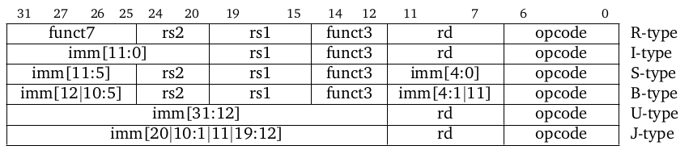

#### 1.3.1.1 hardwire方式

hardwire的方式实现是通过组合逻辑电路实现。对于每一条指令的machine code(0/1序列)，control unit会产生相应的control signals，从而控制datapath，实现对应的操作。

大致结构如下

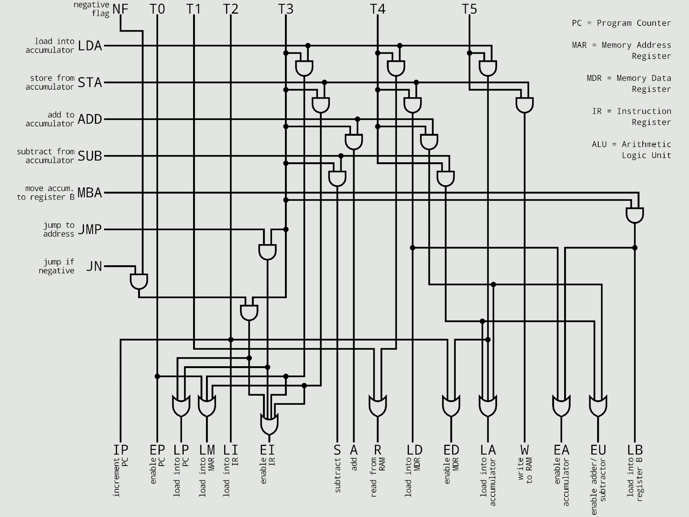

hardwire方式的实现又可以分为Single Cycle和Multi Cycle实现。


##### 1.3.1.1.1 Single Cycle实现

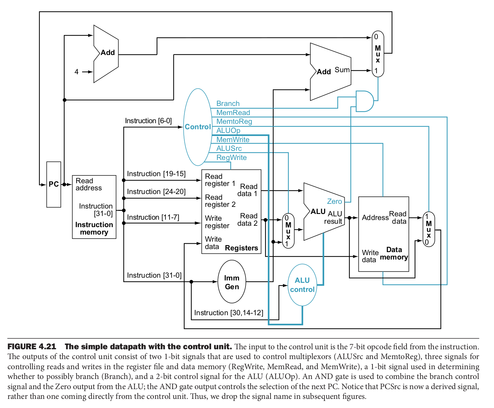

单周期的实现的hardwired control unit就只需要组合逻辑电路，对于每条指令产生对应的控制信号。

这里以RISC-V的部分指令为例，按照[1.3](#1.3-Microarchitecture)中的设计方法，得到一个真值表。RISC-V中指令类型除了与op字段有关，还和func字段有关。因此需要两个控制器，op(主控)，func(ALU局控)，所以还需要一个func字段相关的真值表。

ALU control function有4个bit的输出(**Operation3, Operation2, Operation1, and Operation0**)，真值表如下

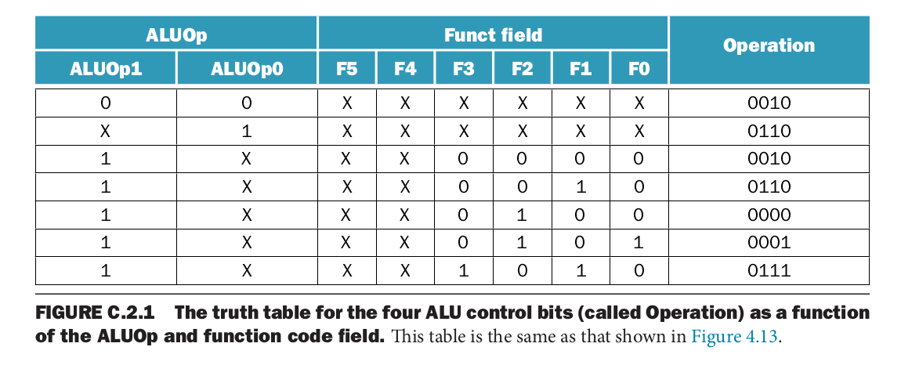

实际上ALU control function的真值表是从下面这张表简化而来的，因为对于

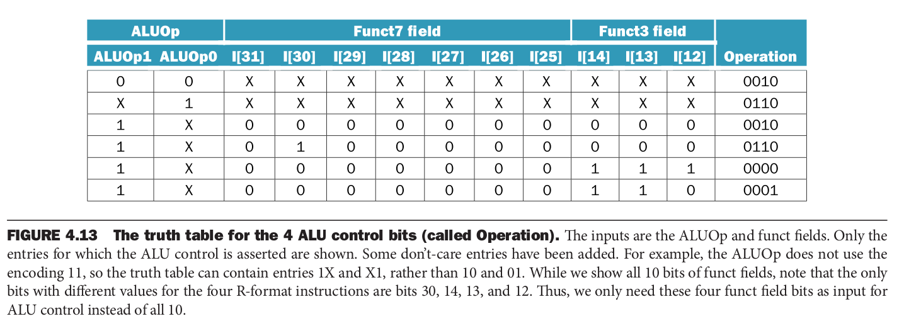

通过真值表，可以设计出ALU controller

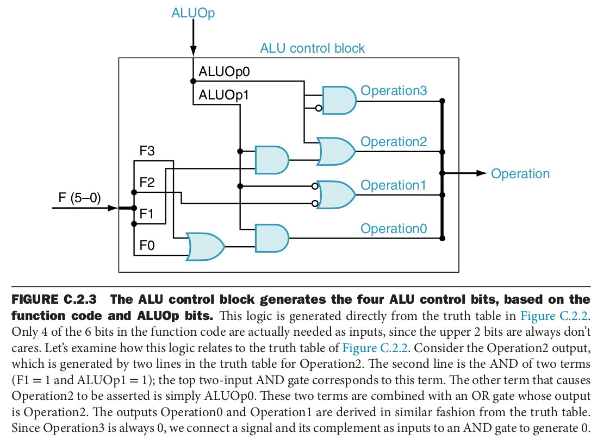


每条指令与真值表是一一对应的关系，通过真值表，设计组合逻辑电路，就可以实现decoder，而main control function真值表如下

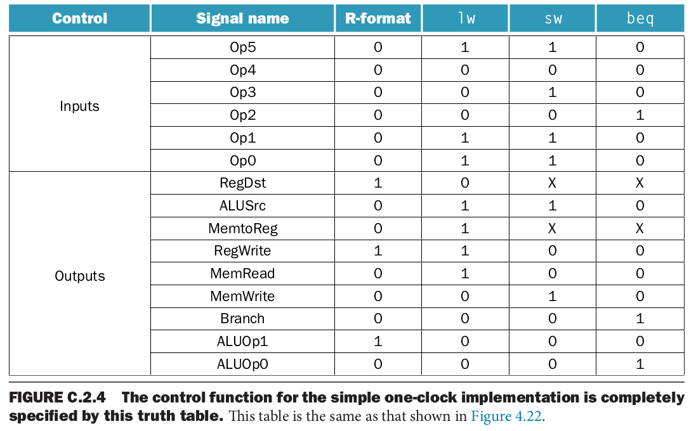

得到真值表后，就可以利用数字逻辑的方法设计组合逻辑电路，设计出的main controller

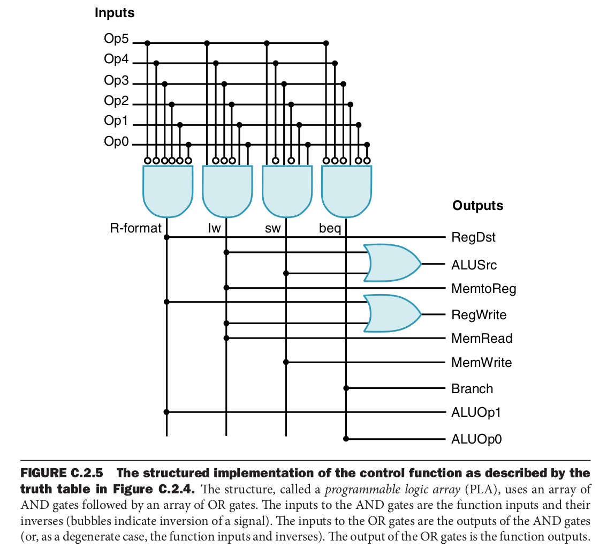


##### 1.3.1.1.2 Multi Cycle实现

而对于Multi Cycle的hardwired control的实现，则需要组合逻辑与时序逻辑的结合。

sequential control function以opcode字段与当前状态作为输入，输出是control signal以及下一个状态。


整体的结构如下

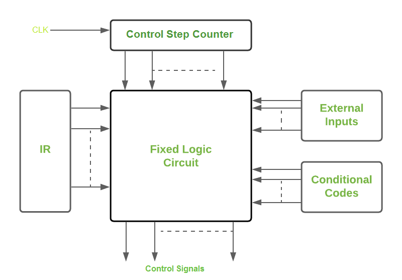

整个fixed logic circuit由encoder与decoder构成。

输入为IR(Instruction Register)中的指令，以及External Inputs(比如intertupt signals，以及Conditional Codes(比如一些标记位)，输出为control signals。

decoder用于解码指令，解码后的输出与external input和conditional code一起作为encoder的输入，最后输出control signal。


一条指令有时并不是在一个时钟周期内执行完毕的，会被拆解成几个部分，在时钟的协调下执行。


采用hardwire方式实现的control units更快但是不灵活。


比如对于MIPS中的


### 1.3.2 Microcode方式

microcode也叫做microprogram。

采用microcode方式实现的control units，microcode也相当于一层abstraction layer，将

通过microcode来实现ISA的指令(machine code)，microcode是circuit-level的操作。


一些硬件厂商有时也会用microcode代指firmware。


### 1.3.3 Single Cycle


### 1.3.4 Multi Cycle


## 1.4 System Design

**von Neumann architecture(Princeton architecture)**

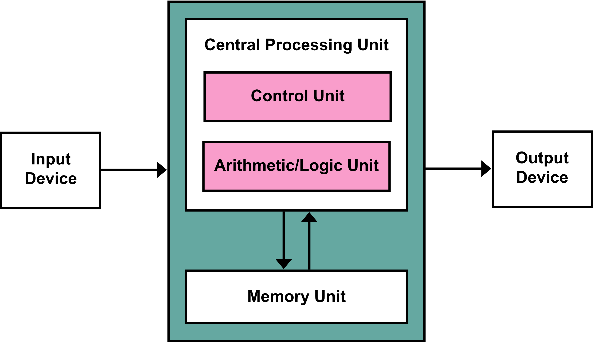

**Harvard architecture**

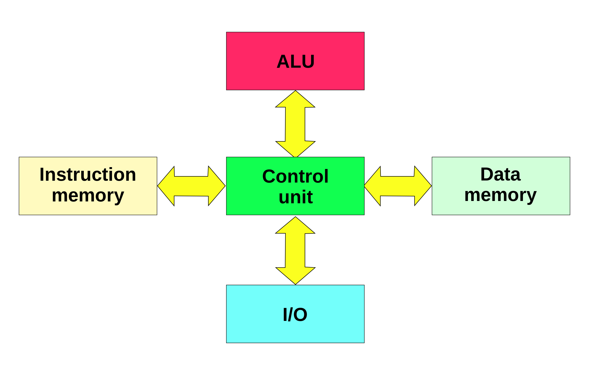


## 1.5


# 2. 制程

制程**technology node** (also **process node**, **process technology** or simply **node**)，最早是用以表示栅极的长度(**gate length**)和金属半间距(M1 half-pitch size，这里的M1指的是lowest metal layer，metal 1)。

每一次制程的提升，一部分是缩短晶体管之间的距离(缩小half-pitch size)，另一个就是缩小晶体管的尺寸(gate length)。

但是后来随着制程的不断进步(FinFET等技术)，"*nm"这个数字失去了其原本的意义，最近的一些制程纯粹是指采用特定技术制造的特定一代芯片，不对应于任何栅极长度或半间距。只是代表一种技术的迭代。


线性的0.7倍缩放，在面积上就约为0.5倍，遵循着摩尔定律。


# 3. Intel


## 3.1 Intel制程


## 3.2 List of Intel CPU microarchitectures(Intel CPU架构的演变)


