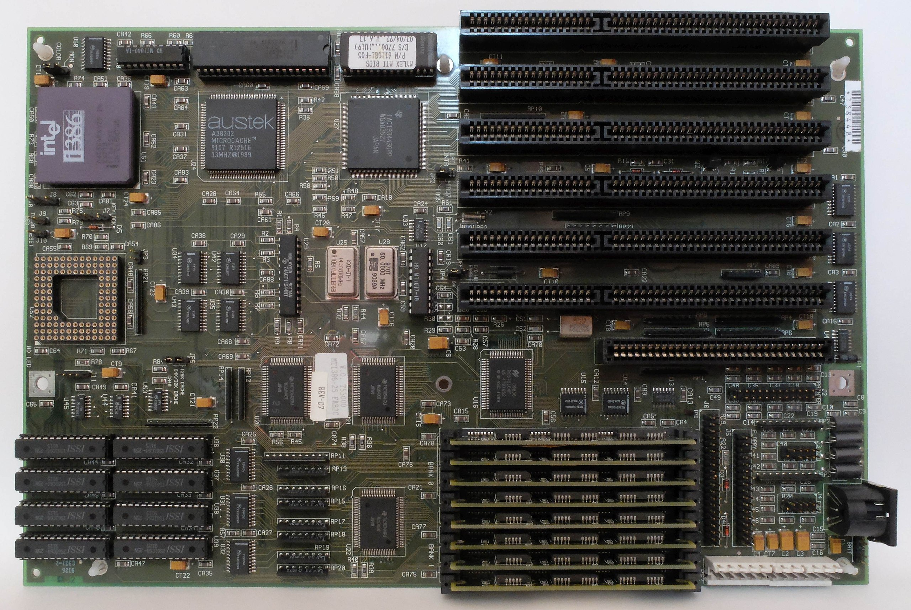

# Cache

# 1. Cache的基础

# 2. Cache的发展历史

参考：

- [L1 L2 L3 Cache到底放在哪里好呢？](https://cloud.tencent.com/developer/article/2246616)
- [CPU cache Wiki](https://en.wikipedia.org/wiki/CPU_cache#History_2)

最早的CPU是没有Cache的，早期的CPU主频很低，甚至都没有内存的频率高，所以无需Cache，CPU直接读写内存。

而从80386开始，CPU的主频(>20MHz)开始远高于内存频率，CPU访存成了瓶颈。因此需要Cache提升访存的性能。但这时的Cache是外部Cache(主板左下角的8片DIP Cache芯片)，并且需要独立的Cache Controller(CPU右边的Austek Cache Controller)，并且这时的Cache是Write-Through的。

但从80486开始，Cache被集成到了CPU die内部，这时的Cache是L1 Cache，而主板上的Cache则是L2 cache。

这个时候主板上的外部Cache还是非常流行的，但是随着SDRAM的出现以及不断增大的CPU频率与总线频率(外频)的差距，外部Cache以及无法带来性能提升。

# 3. 缓存一致性