# 1. CPU


## 1.1 CPU制作过程

半导体芯片行业的三种运作模式：

1. IDM(Integrated Device Manufacture) 集芯片设计、芯片制造、芯片封装和测试等多个产业链环节于一身
2. Fabless 无工厂模式，就是只做芯片设计和销售，其它环节全都使用外部资源
3. Foundry 代工厂模式，就是不负责芯片设计，只进行芯片生产的模式


**掩模版(photomask)**：一般一个mask代表一层电路，对于具有多层的电路的CPU，需要多层光照；有的复杂电路需要多层mask来完成一层电路。


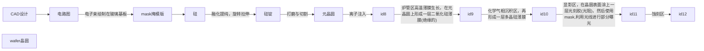

### 1.1.1 先进封装


### 1.1.2 wafer的彩色由来

参考:

- [Why does the inside of a CPU look colored?](https://superuser.com/questions/1212425/why-does-the-inside-of-a-cpu-look-colored)
- [Why are microprocessor wafers so colorful?](https://www.quora.com/Why-are-microprocessor-wafers-so-colorful)

对于一块processor，在光线照射下其不同的区域(缓存，核心，内存控制器等)会显示出不同的颜色，对于这种现象由不同的说法，但是基本原理都离不开光学上的**干涉**与**衍射**。

1. 第一种说法是芯片表面的规整结构(线路与晶体管)构成了一个光栅，对光有衍射作用
2. 第二种说法是芯片由一层层类似薄膜的结构构成，薄膜结构对光产生多重反射与衍射，形成不同的颜色


### 1.1.3 半导体工艺

半导体的工艺可以分为前端与后端：

- 前端：晶圆制作和光刻，具体又可以细分为
  - FEOL
  - BEOL
- 后端：芯片的封装


### 1.1.4 关于制程Process


## 1.2 缓存一致性

### 1.2.1 多核处理器的历史

提高处理器性能可以从三个方面来提升：

- 主频
- 更多晶体管
- 多核


最早提升处理器性能就围绕着提升主频竞争(Intel与AMD)。而频率受到[流水线]()中最长最慢阶段的限制，  因此出现了[超流水线技术]()，将流水线中比较长的阶段拆分成更多更短但是更深的超流水线。

但流水线过长带来的弊端：

- 单位频率效能低下
- 分支预测惩罚增加
- 散热问题


集成的晶体管数目的增长放缓，摩尔定律逐渐失效。因此通过升级工艺提高处理器性能也放缓。


因此目光放在多核处理器来提升CPU的性能。


### 1.2.2 多核处理器结构


多核性能/单核性能


### 1.2.2 多核处理器的缓存

目前大多数处理器有三级缓存，每个核心单独的L1(分为L1-I和L1-D)和L2缓存，所有核心共享L3缓存。

其中L2缓存也叫做MLC(Middle Level Cache)，而L3缓存也叫做LLC(Last Level Cache)。


### 1.2.3 多级存储带来的问题

1. 映射规则
2. 查找方法
3. 替换策略
4. 写策略：Write-back/Write-through，这里是多核处理器缓存一致性最关心的问题


### 1.2.4 缓存一致性

CPU1与CPU2分别执行一个进程的两个线程，采用Write-back策略，会出现不一致的情况。

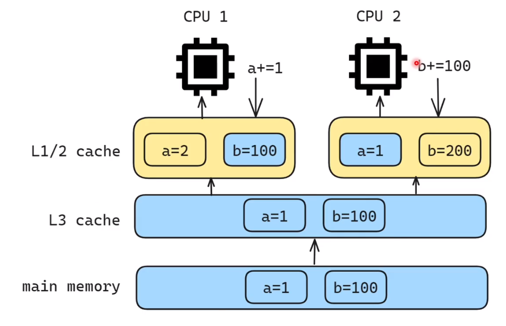

缓存一致性协议：

- 监听协议
- 目录协议


#### 1.2.4.1 监听协议(Snoopy)

监听协议使用的信号有两种选择：

- **写入失效协议(Write-invalidate)**

  

- **写入更新协议(Write-update)**

但是写入失效协议使用的更多。

**MSI**协议


#### 1.2.4.2 目录协议(Directory-based)


## 1.3 CPU流水线


## 1.4 Intel CPU

### 1.4.1 Server端

#### 1.4.1.1 E系列(E3, E5, E7)

特点：没核显，俗称洋垃圾

```
首先呢，不论中外，为稳定性计，机房里的服务器都不可能“新三年旧三年修修换换又三年”，而是严格遵循定期强制报废和替换制度。这个强制报废期，通常是服务器整机的保修期。
```


## 1.5 CPUID与Vendor ID

CPUID是X86架构下的一组附加指令，用于获取关于CPU自身的一些信息。


# 2. Memory(RAM)

Computer Memory，RAM，Main Memory(主存)，Primary Storage都是在表述一个相同的概念，就是内存。


内存带宽计算公式：
$$
内存带宽=内存核心频率 \times 内存总线位宽 \times 倍增系数
$$
内存双通道

并不是主板上的内存插槽有多少就能够实现内存多通道，这个是由CPU中的**内存控制器Memory Controller**决定的。

```
A如果CPU只支持内存双通道，那么对于有4个插槽的主板来说，第一二个插槽第一个通道，第三四个插槽第二个通道（但优先24槽）。
```


不对称双通道


内存控制器，内存通道与DIMM。


## 2.1 DRAM

目前大多数的电脑的主存都是采用**DRAM**，更具体地说，是**DRAM**下的**DDR SDRAM**，除了**DDR SDRAM**，**DRAM**还有许许多多其它的子类。

但是DRAM也只是所有Memory种类中的一种。


### 2.1.1 DRAM结构

对于DRAM，存储数据的方式是通过一个Capacitor(电容)存储的。每一个bit的数据被存储在一个DRAM Cell中。这个DRAM Cell的结构可以有多种变体，最常用的是one-transistor，one-capacitor(1T1C) cell结构。transistor用于控制电流流入(写)与流出(读)。

由于结构中存在电容，因此**DRAM需要定期刷新**，这是DRAM区分于SRAM的一个重要特点。

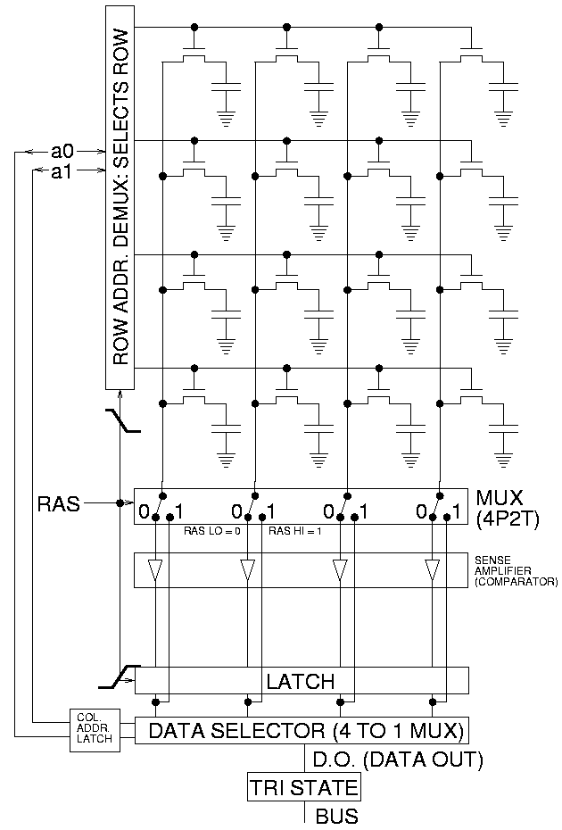

上面是一个4x4的DRAM array，可以看到，每一个DRAM Cell都由一个transistor与一个capacitor组成。

下面是一个更为通用的DRAM array结构，

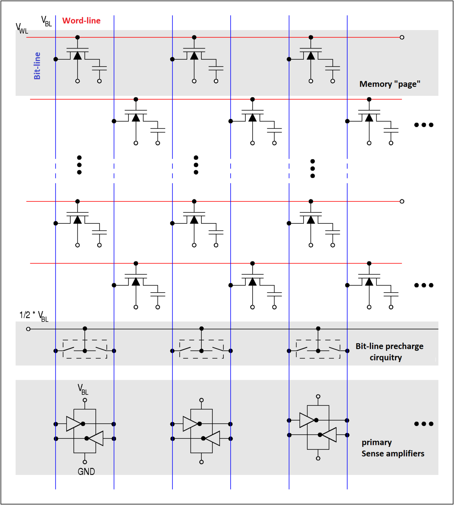


### 2.1.2 DRAM容量的组成方式

在DRAM容量的组成方式之前，先介绍几个概念

#### 2.1.2.1 Memory Module

**Memory Module**也就是内存条，一个Memory Module上有许多块DRAM芯片(也叫内存颗粒)。

一些标准的Memory Module类型：

- Single In-line Memory Module ([SIMM](https://en.wikipedia.org/wiki/SIMM))
- Dual In-line Memory Module ([DIMM](https://en.wikipedia.org/wiki/DIMM))
- Small outline DIMM ([SO-DIMM](https://en.wikipedia.org/wiki/SO-DIMM)) 笔记本上使用最多。
- MicroDIMM

上面几种是常见的Memory Module类型，除此之外还有一些其它的，这里不再赘述。在上面几种Memory Module中，DIMM是最为常见的。

DIMM是SIMM的升级。由于Intel P5-based Pentium处理器有着64-bit的总线带宽，而SIMM只有32-bit的带宽，因此需要两条SIMM才能够填满带宽，并且CPU需要并行访问两块SIMM。

为了解决SIMM带宽不足，DIMM有着64-bit的带宽。DIMM 64-bit带宽的实现方式，相当于将两块SIMM集成到一块DIMM的两面，因此DIMM两面的引脚(金手指)不像SIMM是互通的，而是各自独立传输信号，实现带宽的翻倍。

DIMM与SO-DIMM本身，也有多种变体，区别在于pin的数量上

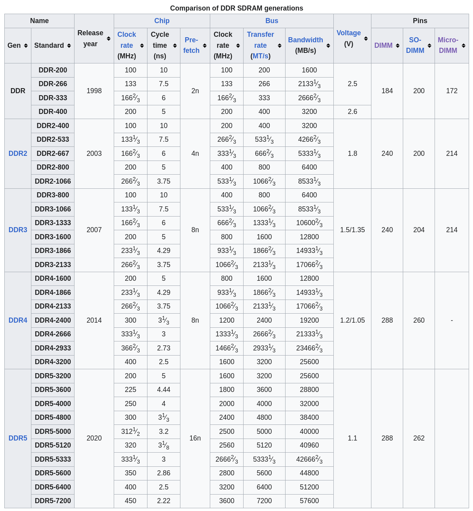


#### 2.1.2.2 Bank

内存采用的是Byte-Addressing，因此当我们访问某一个地址时，实际访问的是该地址对应的8个bit。对于这8个bit，每一个都需要一个DRAM Cell Array，这8个同时被访问的DRAM Cell Array就是一个bank。**通常一个DRAM芯片中有多个bank。**


但是一个bank的位宽不一定一定是8-bit，还可以是16-bit，还可以是4-bit。这个bank的位宽与DRAM芯片的位宽是相同的。


#### 2.1.2.3 Rank

一个memory rank是连接在同一个片选(chip select)信号的一组DRAM chips。因此一个rank中的DRAM chips是同时被访问的。

之前提到过，DIMM的位宽为64-bit，而当DRAM芯片的位宽为8-bit时，需要同时访问8个DRAM芯片才可以得到64-bit，这时一个rank就有8个DRAM芯片；当DRAM芯片位宽为16-bit时，只需要4个DRAM芯片就可以得到64bit，这时1个rank就有4个DRAM芯片。


因此内存通常会有一个参数：2Rx16，1Rx16，1Rx8。这里的**R**就是Rank的数量，而后面的数字就是DRAM芯片的位宽。


多个**Rank**的作用，参考wiki词条[Memory rank]()


#### 2.1.2.4 DRAM容量的组成方式：字拓展与位拓展

位拓展类似于将多个DRAM并联，从而提升整体的位宽。

字拓展类似于将多个DRAM串连，从而提升整体的容量。


### 2.1.3 DRAM时序

SDRAM的时序由4个参数描述
$$
t_{CL}-t_{RCD}-t_{RP}-t_{RAS}
$$


### 2.1.4 不同DRAM类型


#### 2.1.4.1 SDRAM([Synchronous dynamic random-access memory](https://en.wikipedia.org/wiki/Synchronous_dynamic_random-access_memory))

这里的**Synchronous**表明，DRAM的时钟是由外部时钟(也就是主板上的时钟)提供的，所有关于SDRAM的命令的发送与数据的传输都是由外部时钟同步的。

#### 2.1.4.2 DDR SDRAM

**DDR(Double Data Rate)**，双倍的传输速度，在时钟的上升沿与下降沿都传输数据，实现双倍的传输速度。市面上的绝大多数内存都是DDR内存，只不过代数不同。

- DDR
- DDR2
- DDR3
- DDR4
- DDR5 最新一代的DDR，DDR5的标准频率可以到达3600MHz，换算成传输速率，可以达到7200MT/s。


DDR下面还有一个子类，**LRDDR(Low-Power Double Data Rate)**，是一种为移动端设计的DDR。


#### 2.1.4.3 Registered/Buffered Memory

Registered Memory也是DRAM的一种，区别在于增加了一组Register(寄存器)。当Registered Memory采用DIMM时，也被叫做RDIMM(之后就用RDIMM代指Registered Memory)；相反，Unregistered Memory，采用DIMM叫做UDIMM，一般都直接用DIMM。


RDIMM在DRAM与CPU的Memory Controller之间加入了一个中间层，register/buffer。RDIMM相比于UDIMM，其容量与


相比于Unregistered Memory，RDIMM有轻微的性能损失，这里的性能损失主要表现在延迟上。


RDIMM又有几个子类：

- **LR-DIMM**
- **FB-DIMM**


#### 2.1.4.4 ECC Memory

**Graphics Double Data Rate 5 Synchronous Dynamic Random-Access Memory** (**GDDR5 SDRAM**)


#### 2.1.4.5 GDDR

**Graphics DDR SDRAM** (**GDDR SDRAM**)


#### 2.1.4.6 HBM

**High Bandwidth Memory** (**HBM**)，是一种3D-stacked SDRAM。通过将多个DRAM dies堆叠成一个3D结构，实现更高的带宽。

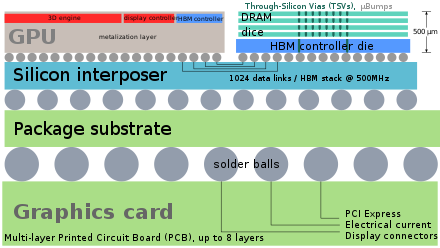

不同die之间的通过TSVs([through-silicon vias](https://en.wikipedia.org/wiki/Through-silicon_via))与[microbumps](https://en.wikipedia.org/wiki/Microbump)垂直连接。

HBM带来的带宽提升是巨大的，在DDR中DRAM芯片一个bank的位宽是4/8/16-bit，而在HBM中一个4 DRAM dies(4-Hi)的HBM stack，每个die有着两个128-bit的通道，总共的位宽就是1024-bit。而有着4个4-Hi HBM stack的GPU总线的位宽就能达到4096-bit。


HBM与CPU/GPU的连接，是通过一个Silion interposer，将HBM连接到GPU/CPU的Memory Controller上。


## 2.2 SRAM

### 2.2.1 SRAM结构

SRAM仅通过transistor构成的flip-flops存储数据，不同于DRAM，SRAM更快但也更贵，不需要定时刷新。

SRAM Cell的结构如下，这是最为常见的SRAM Cell结构，由6个MOSFET组成，也叫做**6T SRAM Cell**。


除了6T SRAM Cell，还有其它许多不同数量transistor组成的SRAM Cell结构，但是6T是最常见的。

### 2.2.2 SRAM应用

寄存器，CPU cache都是采用SRAM。除此之外还有单独的SRAM芯片。

与DRAM类似，SRAM也分同步与异步，也可以有DDR SRAM。


## 2.3 内存带宽


## 2.4 XMP


### 2.4.1 XMP的前身：SPD

SPD(Serial presence detect)


对于高频内存，如果不做任何调整，其默认工作频率是在2133MHz。


# 3. 平台

**HEDT平台**


# 4. 显示器

显示器的几个参数：

- 面板
- 分辨率
- 尺寸
- Free-sync和G-sync
- 刷新率
- 色域、色深、色准、色温


## 4.1 显示器面板

市面上主流的显示技术：

- **LCD**液晶，电压控制液晶的偏转角度，从而控制像素亮度，再加上彩色滤光片，过滤成红绿蓝三色光，再控制不同颜色光的亮度，从而混合出不同颜色。

  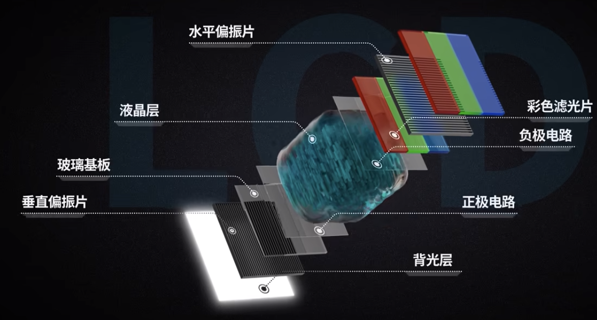

  而背光所有像素共享一整块大的背光，背光常亮，因此存在**漏光**，对比度低。

  LCD屏幕根据液晶的排列与偏转方向，又可以分为：

  - **VA** 液晶分子默认状态垂直，施加电压后垂直螺旋旋转
  - **IPS** 默认水平状态，施加电压后水平平行旋转
    - **Nano IPS**提升色彩（色域）
    - **Fast IPS**提升响应速度
  - **TN** 默认水平螺旋旋转（透光状态），施加电压垂直旋转

  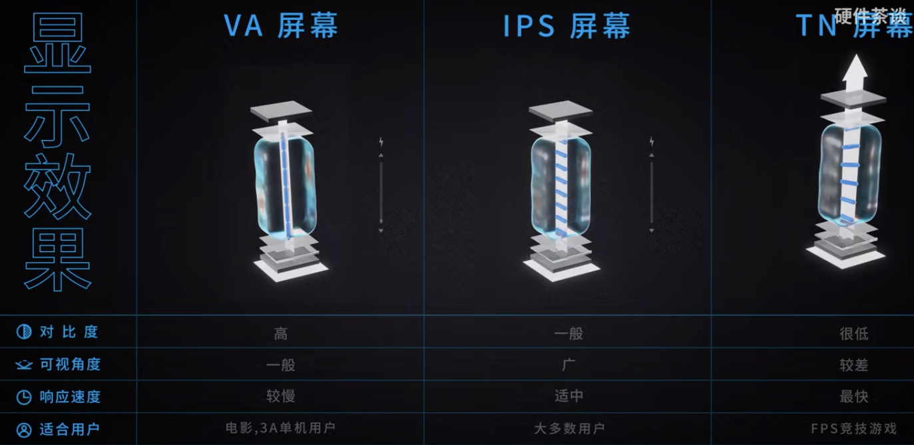

  而根据背光的分类，又可以分为：

  - **QLED**也是属于LCD的范畴，只是采用不同的背光，采用量子点

    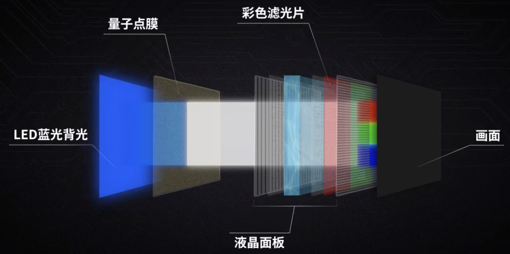

  - **miniLED**也是LCD的范畴，将一整块的背光替换成许多个LED灯珠，分区背光。但是许多像素可能会共享一块背光，因此在显示小物体时可能会出现光晕现象。**但是QLED也可以采用MiniLED的技术。**

- **LED**关键在于如何将LED灯柱做小，并且由于每一个LED单独控制一个像素的颜色和亮度，相当于像素级别的分区背光。

  - **OLED**有机物作为发光材料，寿命短容易老化，峰值亮度低。

    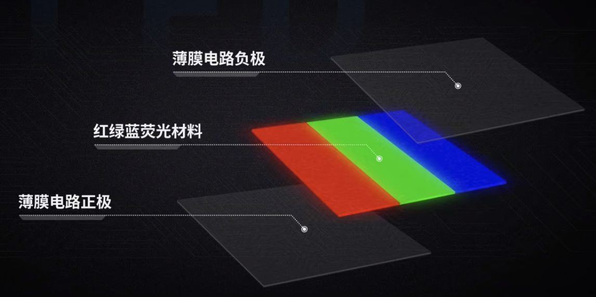

  - **W-OLED**不采用荧光材料发出红绿蓝三色光，而是采用白色荧光材料，再通过滤光片实现不同颜色。

  - **QD-OLED**利用了QLED中的技术，通过蓝光激发量子点材料发射出红色和绿色光，只需要蓝色光的荧光材料。

  - **micro-LED**有机荧光材料始终存在老化的问题，而micro-LED就是将无机的LED灯管做的足够小，不需要背光与液晶。

    **巨量转移技术(薄膜转移)**


总的对比：

- 寿命：LCD寿命长，而OLED寿命短

- 响应时间：LCD响应时间比OLED响应时间慢

- 对比度：OLED比LCD的对比度高

- 色彩：OLED的色彩比LCD更丰富

- 亮度控制：LCD通过DC，OLED通过PWM调光，可能会带来屏闪现象

  LCD的蓝光比OLED的蓝光更加伤眼，而OLED的PWM调光也会伤眼。


## 4.2 垂直同步，Gsync和Freesync

**逐行扫描**：显示器绘制一帧是一个一个像素开始绘制的

**VBlank**：


**帧数 != 刷新率**

## 4.3 VESA


## 4.4 子像素的排列方式


# 5. Storage

## 5.1 SSD

一块SSD的构成：

- NAND flash闪存芯片
- DRAM缓存芯片
- SSD Controller主控芯片

### 5.1.1 主控芯片

- 通过**固件算法**执行Wear leveling耗损均衡
- 识别坏块，OP block
- Controller
- 纠错，LDPC纠错算法

### 5.1.2 闪存芯片

3D NAND


SLC MLC TLC QLC


**原片，白片，黑片与大S**：

- **原片** 原厂正片
- **白片** 白片的质量可能要更低，但是白片也不一定是差产品
- **黑片** 

原厂正片>白片(降级片)>自封片>垃圾(黑片，划线片，回收片)


## 5.2 闪存Flash


## 5.3 UES


## 5.4 eMMC


## 5.5 3D X-Point

Intel Optane


## 5.6 RST快速存储技术

3D X-POINT

将SSD和机械硬盘通过RAID绑定在一起，SSD作为机械硬盘的外缓，起到加速盘作用。


低队列单线程4K随机读写。

## 5.7 HDD

HDD的分类：

- LMR
  - CMR
  - SMR
- PMR

# 6. GPU

2D输出卡+3D加速卡+视频编解码卡

以NVIDIA显卡为例

## 6.1 总的架构


## 6.2 性能指标

FP64

FP64 Tensor Core

FP32

FP16

BF16

TF32 Tensor Core

FP16 Tensor Core

BF16 Tensor Core

INT8 Tensor Core

INT4 Tensor Core


## 6.2 AMD RDNA


# 7. 一些性能工具

- CPU-Z
- GPU-Z
- HWINFO
- CrystalDiskMark(CDM)
- AIDA64
- Memtest86
- Thaiphoon
- core temp


GPU监测工具：

1. nvitop
2. nvtop
3. gpustat
4. nvidia-smi


# 8. PS/2接口

PS/2的接口历史非常悠久，先今的许多主板上依然会保留这个接口。

为了更好地了解PS/2接口以及其为什么流传至今，首先需要理解USB的工作原理，看[这里]()。


PS/2接口允许中断CPU，理论上延迟为0。PS/2有更高的中断优先级。USB需要加载驱动，而PS/2免驱，更加可靠。

 N-Key Rollover(全键无冲)。

PS/2不支持热插拔。


# 9. 大型机与超算


# 10. Hardware Accelerator与DSA

## 10.1 Hardware Accelerator

GPU，APU，TPU，FPGA，NPU，VPU，DPU都是属于Hardware Accelerator的范畴。


## 10.2 DSA(Domain-specific architecture)


# 11. 带宽


## 11.1 内存带宽

内存带宽的计算公式
$$
内存带宽 = 内存频率 \times 内存总线位数 \times 倍增系数 / 8
$$


以DDR为例，DDR每一次传输，传输的数据是内存的位宽(**64bit，存在ECC校验位的情况下，校验位不计入这64bit中，这64bit是纯有效数据**)。

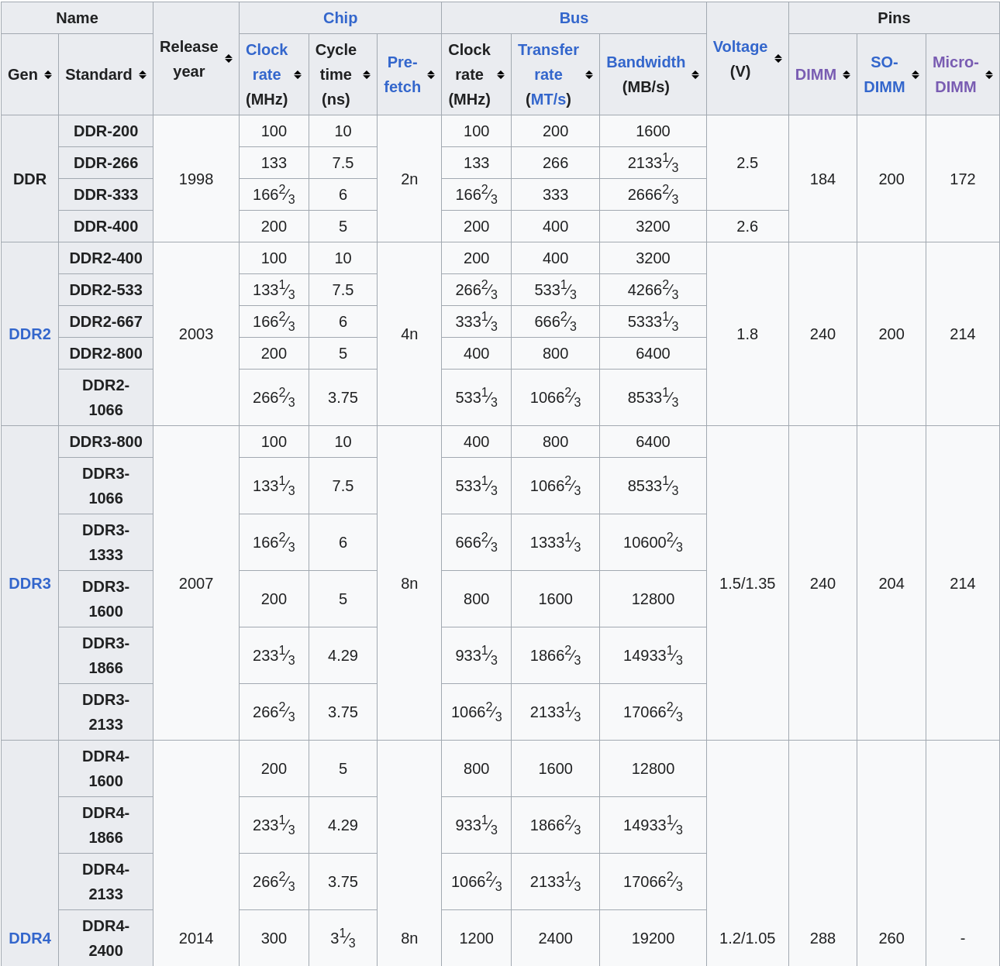

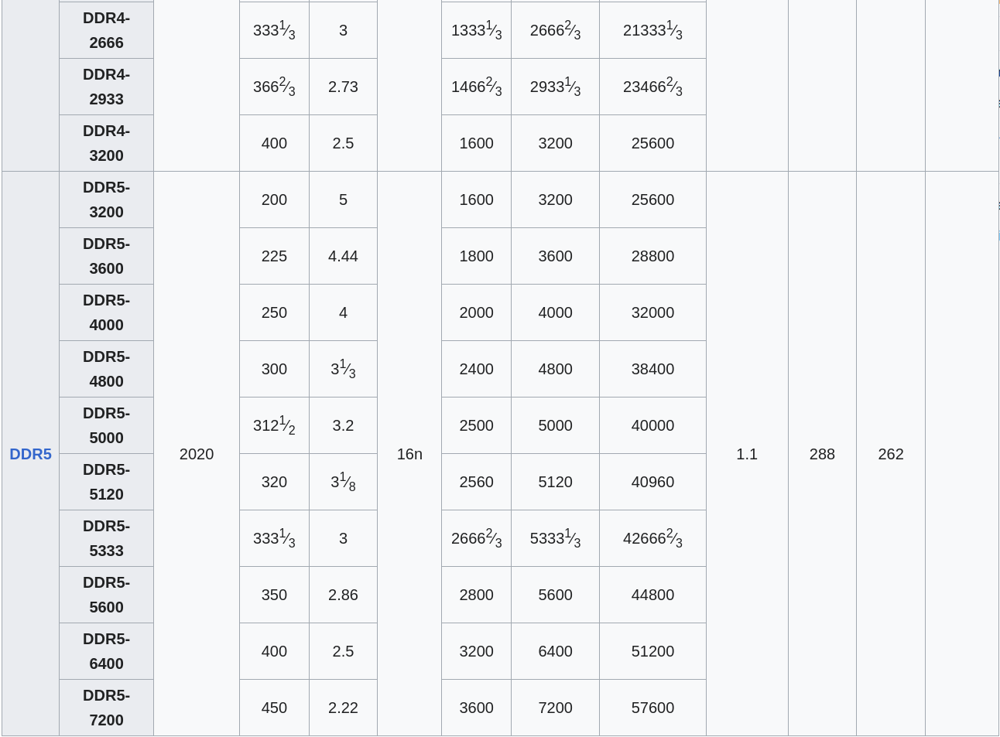


MHz与MT/s都是衡量DDR内存频率的指标，
$$
2MT/s = 1MHz
$$
这里涉及到一个等效频率(effective clock rate)的概念，将时钟频率乘以2代表实际的传输频率，单位仍是MHz，就是以MT/s的速率当作MHz。DDR5的内存条大多以这种形式标注频率。

## 11.2 PCIE带宽

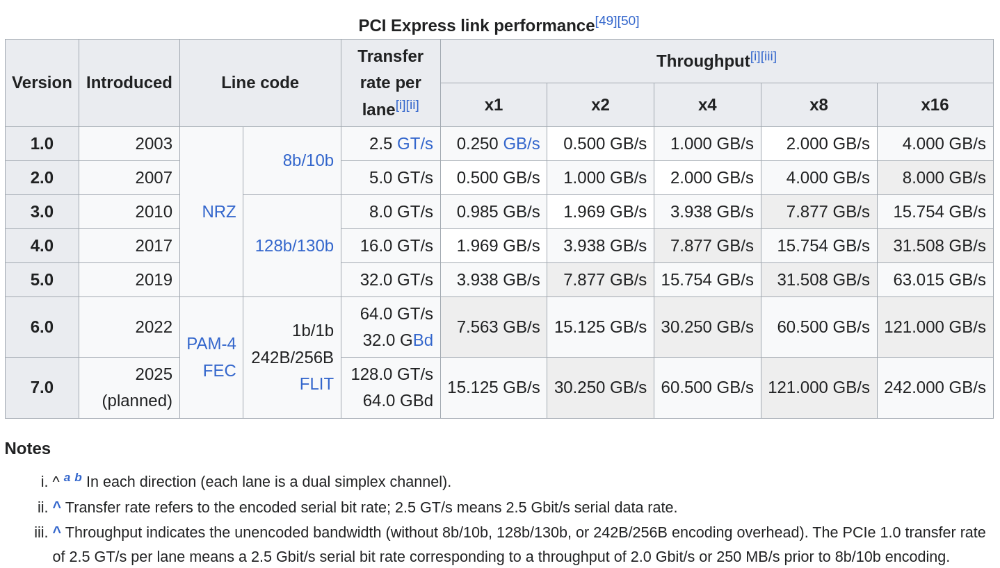

有几点需要注意：

- Transfer rate指的是编码后的数据传输速率。2.5GT/s(**gigatransfers per second**)也就是2.5Gbit/s
- Throughput指解码后的带宽，这是真实有效的带宽
- PCIE每一条lane是全双工的，这里的带宽是对于每一条lane的每一个方向的带宽，而不是总的；如果是总的，还需要x2


## 11.3 网络带宽

对于网络带宽，其单位一般是bps(**bit per second**)。


双绞线


光纤分为单模(SMF)和多模(MMF)


## 11.4 硬盘带宽


# 12. 供电

目前民用交流电标准电压有两种：

- 110V区域
- 220V区域

## 12.1 电源(PSU, Power Supply Unit)

电源的主要作用是将标准交流电(110V/220V)转为低压稳定的直流电，输出的直流电压12V/5V/3.3V三种电压。

## 12.2 电缆


## 12.3 VRM(Voltage Regular Module)

VRM的主要作用是将电源提供的低压直流电进一步降压，为CPU等提供更低(比如0.8V/1V/1.2V)的电压。

VRM的主要工作原理是通过PWM调制以及降压电路实现电压的调节，通过将占空比(duty cycle)设置为10%，就能够实现将PSU提供的12V电压降为1.2V，这是一般现代芯片的工作电压。


VRM可以分为**单相**和**多相**，现代主板VRM都采用多相供电。多相供电，每一相位都承担一部分CPU/GPU需要的电流。其结果是提供给CPU/GPU的平均电压更加稳定。

采用VRM，每一相位一般由个电感(inductor/choke)，一个电容(capacitor)和两个mos管(开关电路)。


## 12.4 显卡供电

显卡供电采用**多相供电**，显卡供电一般是**X+Y相供电**，其中X是核心供电，Y是显存供电。

独立显卡不仅仅从PCI-E通道上取电(对于PCIEx16，只多75W)，还需要外部供电，而外部供电接口就是PCI-E供电接口。

PCIE供电接口有6Pin/8Pin/12Pin/16Pin等类型：

- **6Pin** 

  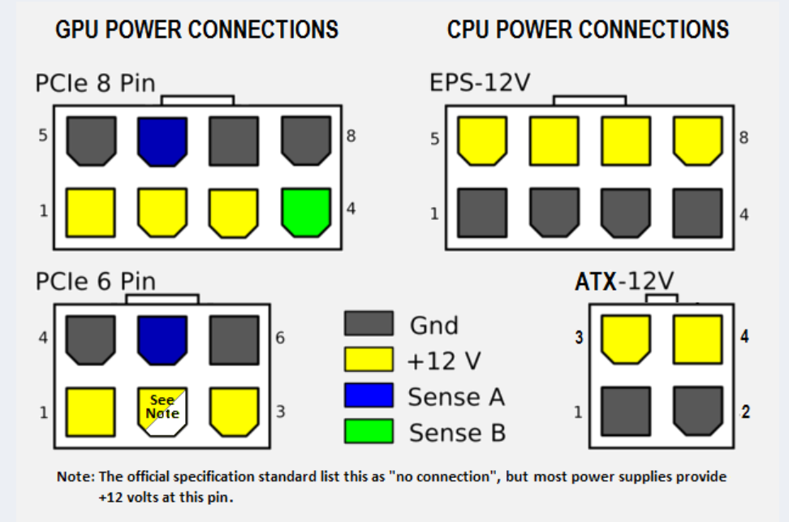

- **8Pin**

- **12Pin**

- **16Pin**

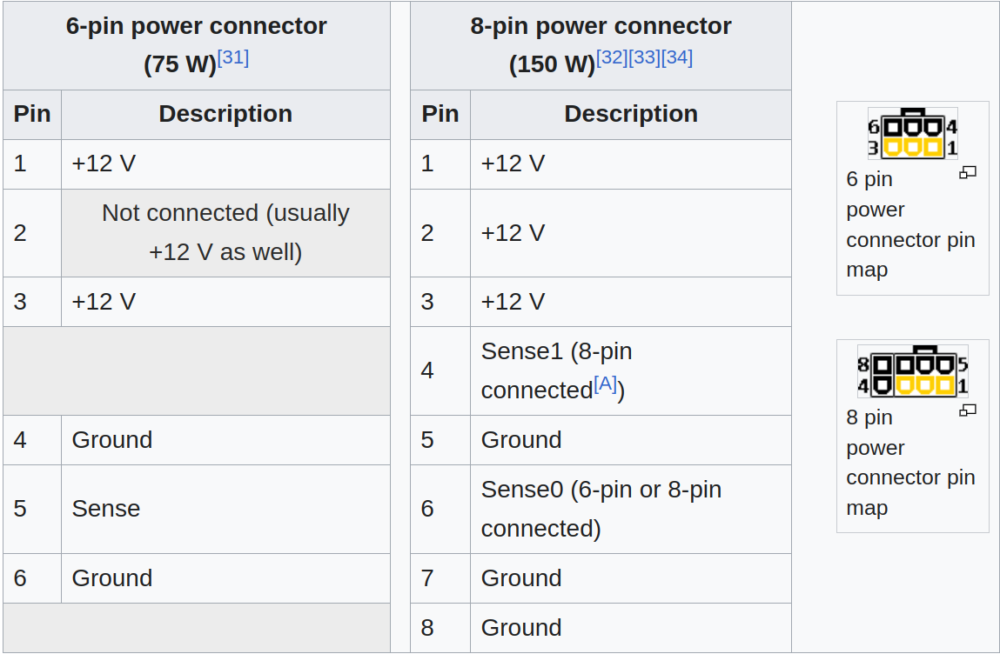

Sense Pin的作用是用于检测供电线缆是否插入，一般来说Sense Pin接地。6Pin的PCIE供电接口工作模式有两种6.25A(75W)和12.5A(150W)。当采用6.25A(75W)的模式时，只需要使用6个Pin，6个Pin中，1和3提供12V的电压，4和6接地承载电流。而5接地用于检测接口是否接入电源，2不连接(但是事实上2会接12V)。电流被分摊在几条接地线上，从而防止单条线路上电流过大。

而为了工作在12.5A(150W)模式下，需要3对12V/groung Pin。并且还需要额外的2个Pin(这两个Pin都接地)，用于告诉PCIE设备，插入的是一个12.5A模式的供电接口，PCIE设备可以工作在150W的功耗下。所以其实许多8Pin接口是6+2的格式。

因此，6Pin线缆是可以插入到8Pin供电接口的。只不过此时PCIE设备只能工作在75W的功耗下。

# 13. 主板


## 13.1 主板尺寸


# 14. CPU与GPU间的通信

现今的GPU，一般是通过PCIe与CPU连接。而PCIe协议


# 15. Chipset


# 16. IEEE 754