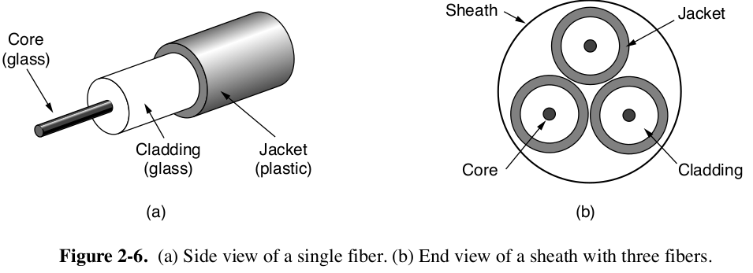

# Computer Network by Tanenbaum


# 2. 物理层


## 2.1 Guided Transmission Media

带宽的单位：Hz

不同的传输介质在frequency，bandwidth，delay，cost以及ease of installation and maintenance这几个方面都有取舍。

### 2.1.1 Persistent Storage

Amazon卡车运数据，**Snowmobile**。

```
Never underestimate the bandwidth of a station wagon full of tapes hurtling down the highway.
```

**永远不要忽略一辆载满磁带的在高速公路上飞驰的卡车的带宽**

带宽高，但是延迟高。


### 2.1.2 Twisted Pairs

差分信号传输，既可以传输模拟信号，也可以传输数字信号。最早用于电话线，现在也用于局域网。最早双绞线只有一对，现在的**Cat 5e**双绞线可以有4对。

双绞线有多种类型，不同的局域网标准会使用到不同的双绞线


双绞线还有**UTP非屏蔽双绞线**与**STP屏蔽双绞线**。


### 2.1.3 Coaxial Cable


同轴电缆有两种规格：50欧姆阻抗和75欧姆阻抗。


### 2.1.4 Power Lines

电力线也可以传输数据。


### 2.1.5 Fiber Optics

光纤可以达到的带宽可以超过50Tbps，并且还远远没有到达光纤带宽的极限，光纤网络几乎可以达到无限的带宽。目前光纤的带宽限制在100Gbps的主要瓶颈是出在光电信号的转换上。

在一条光纤上，会携带许多条通道的数据，以充分利用光纤的高带宽特性。

但是光纤高带宽特性同时也意味着其成本更高，并且更加耗能。


光纤分为**单模(SMF)**和**多模(MMF)**


当光的入射角大于一定角度时，发生全反射，光路被这条光纤中，没有折射导致的损耗。对于一条光纤中，可以有多条光线。因为任何大于临界角度入射的光线，都会在光纤中全反射，因此同一条光纤中可以有多条不同入射角度的光线，每一条光线有一个不同的**mode**，这种类型光线叫做**多模光线(multimode fiber)**。多模光纤的带宽能够达到100Gbps，但是这个带宽会随着传输距离的增加而减小。

而当光纤的直径足够小，小到只有光纤波长的几倍时，此时光纤中的光线将会沿着光纤做直线传播，不会发生反射，这种光纤叫做**单模光纤(single-mode fiber)**。单模光纤更昂贵，适用于长距离传输。


光纤的材料时纯度极高，并且非常细的玻璃。

**Transmission of Light Through Fiber**


光纤传输带宽大，根据波长、频率、波速的公式
$$
v = \lambda f
$$
对于频率与带宽的关系，可以用**Shannon–Hartley**(香农极限)来描述


其中：

1. **C**是
2. **B**是
3. **S**是
4. **N**是
5. **S/N**是

所以对于上述三个band，其频率

**Fiber Cable**



## 2.2 Wireless Transmission

