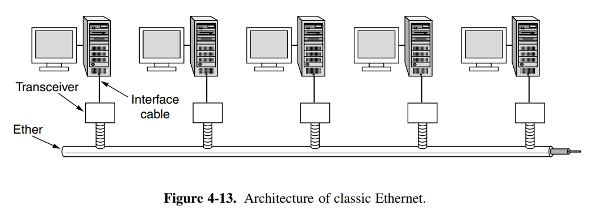
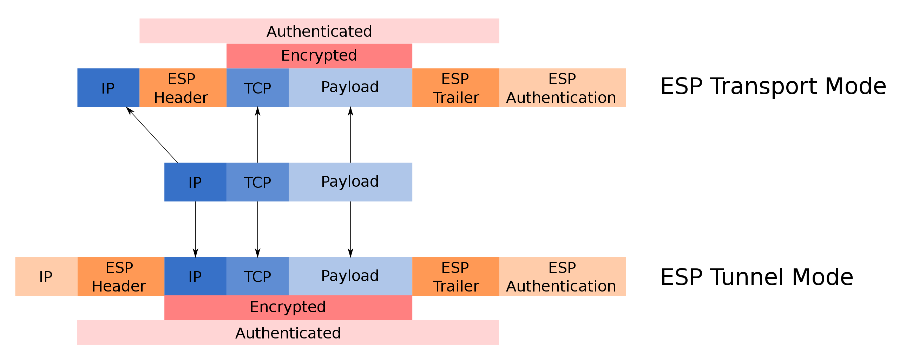

# 1. 计算机网络

TCP/IP参考模型与ISO-OSI参考模型是两个主要的参考模型。

## 1.1 ISO-OSI参考模型

OSI参考模型严格区分了下面三个概念：

- **Services**
- **Interfaces**
- **Protocols**


## 1.2 TCP/IP参考模型

当今的Internet采用的是TCP/IP参考模型


需要注意的是，TCP/IP参考模型中最底层的Link layer，更多的时候叫做**Network Access Layer**。

**TCP/IP模型提出的历史背景，决定了TCP/IP是一个connectionless的参考模型，即TCP/IP不规定底层的物理连接，与具体的网络连接无关，而是通过最底层的Network Access Layer，规定不同链路与Internet Layer的接口**。因此TCP/IP协议栈可以运行在各种各样的链路之上。对于不同的链路，又有其不同的参考模型，比如局域网的802参考模型，不同广域网的参考模型等等。

## 1.3 两种参考模型的优缺点

两种参考模型各有优缺点。


# 2. 局域网

基带和宽带

基带：数字信号

宽带：模拟信号，单向传输，因此需要有一个入径与出径

## 2.1 局域网参考模型 IEEE 802系列标准

局域网参考模型只涉及到OSI参考模型中的物理层与链路层。


而对于TCP/IP参考模型中，并没有对应的层级。

**将数据链路层分为MAC层和LLC层原因**：局域网有许多种类的局域网技术，不同局域网技术采用的MAC方法也不同，通过将链路层分割成一个LLC和MAC层，对于不同的局域网采用不同的MAC层实现同时采用一个统一的LLC层减少设计的复杂度。

MAC层的主要功能（控制物理媒体）：

1. 封装成帧（发送时）
2. 解封装帧（接受时）
3. 实现和维护MAC协议
4. 寻址

LLC层的主要功能（物理媒体无关的部分）：

1. 建立和释放数据链路层的**逻辑连接**
2. 通过SAP（Service Access Point，是OSI中的一个术语，与网络层的接口）与高层通信
3. 差错控制

​	


## 2.2 以太网历史

### 2.2.1 不同以太网标准

1. **Ethernet V1**
2. **Ethernet V2（ARPA，也叫做DIX Ethernet）**
3. **IEEE 802.3**

Ethernet标准与IEEE 802.3之间的差距很小，IEEE802.3规定了物理层和MAC层的部分而Ehternet标准规定了物理层和链路层，二者统称Ethernet以太网。

**目前使用的是Ethernet V2**

### 2.2.2 Classic Ethernet与Switched Ethernet

Ehternet又可以分为classic ethernet与switch ethernet，二者虽然都叫以太网但是不同。

classic ethernet是最早的以太网，速度在3Mbps-10Mbps。

而switched ethernet速度为100，1000和10000Mbps，如今使用的都是switched ethernet。

## 双绞线带宽2.3 以太网基本技术

classic ethernet共享总线，存在media access control的问题。

### 2.3.1 媒体访问控制（Medium Access Control）

CSMA/CD

三种CSMA协议：

1. non-persistent CSMA
2. 1-persistent CSMA **以太网采用的是1-persistent CSMA**，并且在1-persistent CSMA的基础上增加了**帧间隙**，检测到冲突后采取**截断的二进制指数退避算法**
3. p-persistent CSMA


不同随机访问协议的对比，以太网采用的1-persistent效率相比于p-persistent更低，但是**以太网交换技术**使得以太网能够广泛应用。


CD协议用于处理冲突，补充CSMA协议。

**冲突时间**：数据从开始发送到冲突信号传播到总线上每一个站点花费的时间


而冲突时间**a**是右侧除了R以外的其它部分。

冲突时间的作用：

1. 检测一次冲突所需的最长时间
1. 确定最小帧长（64字节）。对于10M以太网，冲突时间51.2us。
1. 截断的二进制指数退避算法需要使用冲突时间来确定发生冲突后何时重传
1. 确定碎片帧长度

### 2.3.2 数据帧格式

Ethernet II格式 **RFC894**

IEEE 802.3格式 **RFC1042**


**Preamble**8个字节，每个字节10101010的bit pattern。802.3中最后一个字节的bit pattern是10101011，用于发送方与接收方的同步

**源MAC地址与目的MAC地址**6个字节。

**MAC地址构造**：

前3 bytes用于OUI(Organizationally Unique Identifier)，由IEEE分配给厂商；后3 bytes由厂商分配。

一般NIC厂商会购买多个OUI。


**Type or Length**：DIX Ethernet这个字段是Type而IEEE 802.3是Length。0x600（1536）为界限，大于为Type小于等于为Length。

由于目前以太网大多使用DIX Ethernet标准，因此这个字段为**Type**，比如IPv4协议为0x800。

对于IEEE 802.3来说，这个字段是这个帧的长度，因此`the Ethernet length was determined by looking inside the data—a layering violation if ever there was one`。但是这意味着对于接收方来说，无法判断这个帧需要交给哪个上层协议来处理。因此IEEE 802.3引入了LLC协议，在LLC层又加入了一个8字节的头部。


**背景知识：为什么目前大多数采用的是DIX Ethernet协议？**

```
在802.3发布之前已经有许多DIX Ethernet的硬件和软件在使用了。因此IEEE认为两种Ethernet标准都可以。先前采用DIX Ethernet标准的Type字段值都是大于1500的，所以采用0x600（1536）作为界限划分Type和Length
```

**Data**：最多1500字节，最少46字节。

### 2.3.3 编解码

不同编码


10M以太网采用曼彻斯特编码

## 2.4 10M以太网（Classic Ethernet）



### 2.4.1 10M以太网的连接种类

#### 2.4.1.1 10Base-5以太网（粗缆总线，一种同轴电缆）


同轴电缆上每隔2.5m都有标记，表明在此处可以连接电脑。

网段长度最大500m，每个网段上最多100节点。

最多5个repeater，因此Ethernet的最大总长度为2.5km，这个长度是由**冲突时间**决定的。

#### 2.4.1.2 10Base-2以太网（细缆总线，一种同轴电缆）

使用BNC connector连接，接触不良会导致整条总线上网络故障，从BNC的结构可以看出

网段长度最大185m，每个网段上最多30节点。


#### 2.4.1.3 10Base-T以太网（双绞线）

有着568A和568B标准，分为三类，五类，六类，八类

1和2，3和6，4和5，7和8构成一对。


同类交叉线连接不同类直通线连接

#### 2.4.1.4 10Base-F光纤以太网（光纤）

光电转换器


### 2.4.2 集线器

**集线器**相当于一个多端口的**中继器（Repeater）**，只是简单的把某个端口收到的包，再广播给其他所有的端口

1. 堆叠式集线器：与级联集线器有区别，延迟更低
2. 其它集线器

级联与堆叠：

1. **级联**：多个集线器通过端口连接
2. **堆叠**：有专用的集线器互联口，多个集线器堆叠相当于一个集线器

## 2.5 100M快速以太网

### 2.5.1快速以太网结构

10M以太网采用曼彻斯特编码，效率只有50%

不归零编码效率100%

编码原则：高低电平数量相近，高低电平变化要多。


**以太网帧间隙**：92bit

## 2.6 1000M以太网

### 2.6.1 1000M以太网分类

#### 2.6.1.1 1000Base-CX（屏蔽铜缆）

#### 2.6.1.2 1000Base-T（5类UTP）

### 2.6.2 帧拓展与帧突发

## 2.7 10G以太网


## 2.8 以太网交换技术


**hub**逻辑上就相当于a single long cable of classic Ethernet。

在以太网交换技术出现之前，经典以太网采用的single long cable的结构。但是single long cable的结构可能会出现单条链路上出现破损导致整个网络出错，因此后续演化成了以**hub**为中心的结构。但是这种结构逻辑上依然等价于single long cable的结构，无法增加链路上所能承受的主机量，随着主机量的增加，链路上的主机共享整个链路的带宽，导致每一条主机能够获得的带宽减少。

解决问题的方式就是以太网交换技术(Switched Ethernet)。

采用共享媒体方式需要利用到CSMA/CD的MAC协议来解决访问共享媒体的问题，但是CSMA/CD使得整个网络处于一个**冲突域**范围。而以太网交换机每一个端口都位于一个独立的**冲突域**中。

当采用的cable也是全双工的，这个时候就不会存在冲突的问题，也就不再需要CSMA/CD。

**但是当采用的cable是半双工的，还是需要使用到CSMA/CD。**

### 2.8.1 网桥与桥接技术

网桥（或者桥接技术Bridging）用于连接两个LAN，形成一个大的LAN。这个路由Routing技术不同，路由连接的网络可以相互通信，但是保持独立性，而桥接不保持独立性而是连接成一个整体。网桥是一个二层设备。

**还有一种网桥，[雷电网桥](./计网.md#雷电网桥)**

网桥有多种类型：

1. **透明网桥（Transparent Bridge）**：工作负担重

   透明网桥成为透明是因为网桥不会修改frame中的内容，而非透明网桥会修改frame中的内容（比如在连接两种不兼容的LAN时）。

2. **SRB（Source Routing Bridge）**：保证路径最短，工作负担较小


网桥工作过程，分为**自学习**和**转发**两个阶段:

1. **自学习阶段**：自学习阶段将每个地址与一个端口对应起来，存储在一张表中（Forwarding information base）。
2. **转发和过滤阶段**：如果一个frame的源地址和目标地址属于不同的网段（端口），则网桥会转发到相应网段；如果属于相同网段（端口），则网桥会丢弃这个frame。


**冲突域与广播域**

- **冲突域**：冲突域是第一层物理层的概念，因此第一层设备连接的节点在同一个冲突域中。而第二层和第三层设备可以划分冲突域。
- **广播域**：广播域是第二层链路层的概念，因此第一层和第二层设备连接的节点都是在同一个广播域中。而第三层设备或者VLAN可以划分广播域。


#### 2.8.1.1 hub与switch区别

网桥一个端口一个网段，**多个冲突域，同一个广播域**，从而缩小冲突域，不同冲突域之间并行发送frame，提升带宽。

集线器所有端口同一个网段，一个冲突域。


#### 2.8.1.2 生成树协议STP

当两个LAN之间有多个网桥桥接链路，可能出现的问题：


- 重复数据帧：A------>C，网桥中存在C的记录，这时C会受到两个重复的frame
- 循环重复数据帧：A------>C，网桥1，2中都不存在C的记录。此时LAN1和LAN2之间产生两个不同方向的循环，C收到大量重复帧，直到C发出一个frame相应A的frame。
- 广播风暴：A发送一个广播帧，LAN1和LAN2之间产生两个不同方向的循环并且无法停止。


网桥之间通过交换BPDU（通过组播）来建立生成树。

组播BPDU，只影响网桥，选出一个Root桥

工作方式：

1. 选root桥
2. 其余桥选root端口
3. 每个LAN选择Designated桥与D端口
4. 除了Root Port和Designated Port，其余Port逻辑上阻塞（能收不能发）

但构造出的不是最优的树，拓扑改变重新计算


#### 2.8.1.3 快速生成树协议RSTP

#### 2.8.1.4 多生成树协议MSTP


**VLAN**：减小广播域


交换机：多端口网桥


### 2.8.2 全双工以太网技术

广域网中的链路都是全双工的，但局域网早先一直处于半双工方式。

虽然早先局域网采用的cable中有两对双绞线与**hub**连接，一对用于发送一对用于接收，但是CSMA/CD协议的约束要求这条cable上要么接收要么发送。因为需要有一条接收线路用于接受jam冲突信号。

而采用**switch**，交换机端口与主机分别使用一对线路进行发送，从另一对接收，不会产生冲突，实现全双工。

### 2.8.3 以太网交换机

交换机的交换方式：

1. **静态交换**
2. **动态交换**
   - **存储转发** 整个帧全收完再转发，适用于大流量通信，使用最多
   - **直通** 收到目标地址直接转发，但有可能转发碎片帧
   - **无碎片** 收到64字节（以太网最小帧长）转发


交换机的基本特性：

1. 端口聚合
2. 端口镜像 抓包
3. 背板总线带宽
4. 转发速率 pps为单位，package per second
5. MAC地址表大小


### 2.8.4 网桥和交换机区别

两种说法：

1. 网桥相当于交换机的前身，二者的工作原理都是相同的。**区别只在于网桥只有两个端口而交换机有多个端口，交换机相当于多端口网桥。**交换机每个端口连接一个站点，而网桥每个端口连接一个总线型LAN。
2. 网桥与交换机是相同的，只不过以前叫网桥，现在叫交换机。

倾向于第二种说法。

## 2.9 以太网交换机

访问交换机：

- 通过Console Port，一般是一个异步串口RS-232，当交换机没有配置好IP时，这是唯一能够访问交换机的方式
- Telnet，明文传输数据
- Web方式
- 专用的网络管理软件（采用SNMP协议，被管理设备需要有SNMP Agent）
- SSH
- TFTP


交换机中的几种存储：

- ROM，存储一个最小的OS，Bootloader
- 内存
- NVRAM，存放配置文件
- Flash，存放OS以及配置信息


交换机端口编号

- **a/b** 模块号/端口号

- **a/b/c** 模块号/子模块号/端口号

## 2.10 VLAN

### 2.10.1

通过VLAN技术分割广播域，广播域中经常会有广播帧（DHCP，ARP等），会消耗带宽。

这里涉及到路由器与交换机的一个区别：**路由器不转发广播帧，交换机转发广播帧，因此路由器的一个端口就是一个广播域**。


通过VLAN，具有相同VLAN号的端口构成一个广播域。不同VLAN之间的站点需要借助路由器通信。

**跨交换机VLAN**

### 2.10.2 VLAN交换方式

#### 2.10.2.1 端口交换


#### 2.10.2.2 帧交换


### 2.10.3 VLAN标准与协议

- **802.10 被淘汰**
- **802.1Q**
- **ISL**
- **VTP（VLAN Trunking Protocol）**

#### 2.10.3.1 802.1Q


在MAC帧头部插入了**TPID**和**TCI**两个字段，每个字段2Bytes，一共四个字节。

**TPID**表明采用的协议，**TCI**包含所处的VLAN id（VID）。

| 16 bits | 3 bits | 1 bit | 12 bits |
| :-----: | :----: | :---: | :-----: |
|  TPID   |        |  TCI  |         |
|         |  PCP   |  DEI  |   VID   |

有上述插入的字段的frame称为**Tagged frame**，不含的称为**Untagged frame**。

**计算机使用的网卡只能发送和接受Untagged Frame，因为主机接口并不能划分到VLAN中，只有交换机上的端口才可以划分到VLAN中。**

VLAN号12bits，全0和全1保留不用，1号端口是Default，默认初始时所有端口都处于同一个VLAN号（1号）下。

一个VLAN一般一个IP子网


#### 2.10.3.2 ISL

ISL是Cisco定义的VLAN标准，是对802.1q的补充。


#### 2.10.3.3 VTP

Cisco的VTP用于集中管理VLAN。除此之外还有非集中式的管理方式。


### 2.10.4 VLAN管理

**VLAN的配置是在交换机的端口上配置，而不是在主机上**，交换机的端口(不论是华为还是思科)，都有三种类型：

- **access port** 用于连接主机上的端口
- **trunk port** 用于连接交换机上的端口
- **hybird port** 既可以连接主机，也可以连接交换机


而链路有两种类型：

- **access link** 用于连接主机与交换机的链路
- **trunk link** 用于连接交换机与交换机或者交换机与路由器的链路


交换机端口的输出规则：

- **Tag** 用以交换机之间互连，用以连接交换机的端口叫做**Trunk**
- **Untag** 用于连接到计算机，配置交换机端口时，需要配置为**access**
- **Unchange** 


VLAN的划分方式：

- 基于端口划分
- 基于MAC地址划分
- 基于IP划分


VLAN端口成员的配置：

- 一个交换机端口可以属于多个VLAN
- 当一个交换机端口属于多个VLAN时，需要有一个默认VLAN，**PVID**

## 2.11 802.11无线局域网

IEEE 802.11标准只是一个标准，并没有实际的产品。

|                       Generation                       |                        IEEE standard                         |                           Adopted                            |                  Maximum link rate (Mbit/s)                  |                    Radio frequency (GHz)                     |
| :----------------------------------------------------: | :----------------------------------------------------------: | :----------------------------------------------------------: | :----------------------------------------------------------: | :----------------------------------------------------------: |
| [Wi-Fi 8](https://en.wikipedia.org/wiki/IEEE_802.11bn) |   [802.11bn](https://en.wikipedia.org/wiki/IEEE_802.11bn)    | 2028[[44\]](https://en.wikipedia.org/wiki/Wi-Fi#cite_note-45) | 100,000[[45\]d type t](https://en.wikipedia.org/wiki/Wi-Fi#cite_note-46) | 2.4, 5, 6, 7, 42.5, 71[[46\]](https://en.wikipedia.org/wiki/Wi-Fi#cite_note-47) |
|    [Wi-Fi 7](https://en.wikipedia.org/wiki/Wi-Fi_7)    |   [802.11be](https://en.wikipedia.org/wiki/IEEE_802.11be)    |                             2024                             |                         1376–46,120                          | 2.4, 5, 6[[47\]](https://en.wikipedia.org/wiki/Wi-Fi#cite_note-48) |
|   [Wi-Fi 6E](https://en.wikipedia.org/wiki/Wi-Fi_6E)   |   [802.11ax](https://en.wikipedia.org/wiki/IEEE_802.11ax)    |                             2020                             | 574–9608[[48\]](https://en.wikipedia.org/wiki/Wi-Fi#cite_note-49) | 6[[b\]](https://en.wikipedia.org/wiki/Wi-Fi#cite_note-only6ghz-2-50) |
|    [Wi-Fi 6](https://en.wikipedia.org/wiki/Wi-Fi_6)    |   [802.11ax](https://en.wikipedia.org/wiki/IEEE_802.11ax)    |                             2019                             | 574–9608[[48\]](https://en.wikipedia.org/wiki/Wi-Fi#cite_note-49) |                            2.4, 5                            |
|    [Wi-Fi 5](https://en.wikipedia.org/wiki/Wi-Fi_5)    | [802.11ac](https://en.wikipedia.org/wiki/IEEE_802.11ac-2013) |                             2014                             |                           433–6933                           | 5[[c\]](https://en.wikipedia.org/wiki/Wi-Fi#cite_note-only5ghz-2-51) |
|    [Wi-Fi 4](https://en.wikipedia.org/wiki/Wi-Fi_4)    |  [802.11n](https://en.wikipedia.org/wiki/IEEE_802.11n-2009)  |                             2008                             |                            72–600                            |                            2.4, 5                            |
|                     **(Wi-Fi 3)***                     |  [802.11g](https://en.wikipedia.org/wiki/IEEE_802.11g-2003)  |                             2003                             |                             6–54                             |                             2.4                              |
|                     **(Wi-Fi 2)***                     |  [802.11a](https://en.wikipedia.org/wiki/IEEE_802.11a-1999)  |                             1999                             |                              5                               |                                                              |
|                     **(Wi-Fi 1)***                     |  [802.11b](https://en.wikipedia.org/wiki/IEEE_802.11b-1999)  |                             1999                             |                             1–11                             |                             2.4                              |
|                     **(Wi-Fi 0)***                     | [802.11](https://en.wikipedia.org/wiki/IEEE_802.11_(legacy_mode)) |                             1997                             |                             1–2                              |                             2.4                              |

### 2.11.1 数据的无线传输

无线电波频段分为管制频段与非管制频段，有几个非管制频段，称为ISM(*industrial, scientific, and medical*)频段，下面是三个用于WLAN的ISM频段：

- 902MHz ~ 928MHz
- 2.4GHz ~ 2.5GHz
- 5.725Ghz ~ 5.875GHz


无线传输分为：

- **单频传输**
- **拓展频谱传输** IEEE 802.11采用了直序频谱扩展技术(**DSSS**)，能够减少噪声的影响


**跳频技术FHSS**

### 2.11.2 无线局域网标准与技术

MAC层的标准是公用的，都是使用802.11 CSMA/CA，物理层存在区别。


### 2.11.3 无线局域网网络结构

主要组成部件：

- **工作站STA**
- **接入点AP**
- **分发系统DS** 一般是AP所连接的以太网
- **无线介质WM**


几种网络结构：

- **BSS基本服务集** BSS中的各个STA需要通过AP进行通信 
- **IBSS独立基本服务集(ad hoc网络，一个临时的网络)** 不包括AP，IBSS中的各个STA直接相互通信 
- **ESS延伸服务集** BSS的覆盖范围有限，多个BSS通过DS互联，形成一个ESS


### 2.11.4 IEEE 802.11 MAC协议

802.11有两种MAC机制：

- PCF(集中访问)，PCF在较大的网络中效率低，没有普遍实现
- DCF(分布访问)，使用较多，将访问控制空能分布到STA上实现


#### 2.11.4.1 CSMA/CA

无线信道由于误码率高，因此需要通过ACK帧解决


#### 2.11.4.2 虚拟载波监听


#### 2.11.4.3 RTS/CTS机制(解决hidden terminal problem隐蔽站/暴露站问题)


a)隐蔽站，A位于C的覆盖区域之外，当C向B传输数据时，A无法检测到，因此A向B传输数据而产生冲突

b)暴露站，A向其传输范围内的D传输数据时，B其实可以同时向C传输数据，但是由于B监听到A正在传输，所以无法同时做到A向D以及B向C传输


通过RTS(Request To Send)/CTS(Clear To Send)机制解决上述问题。


RTS/CTS机制适合传输较大的帧。


WiFi帧的抓包，WireShark抓到的包是做过转换的，如果需要抓WiFi的包，需要特殊的网卡。


WiFi有三种帧：

- **控制帧**
- **数据帧**
- **管理帧**


数据帧的四个地址字段：


家用路由器：AP + 路由器 + 交换机


帧间隔时间IFS：

- **DIFS**
- **SIFS**


## 2.12 802.15蓝牙

采用蓝牙组成的网络称为Piconet。一台主设备，其它为从设备。

FHSS跳频技术


# 3. 广域网与网络接入


## 3.1 接入网

### 3.1.1 电话网

利用电话网接入网络


**Modem** 


**PPP**协议(链路层协议)

### 3.1.2 ISDN接入


### 3.1.3 xDSL接入


### 3.1.4 HFC和Cable Modem


### 3.1.5 光纤接入

光纤接入网的组成：

- **OLT** 提供与公共网本地交换机之间的接口
- **ODN**
- **ONU** 提供用户侧的接口
- **SNI**
- **UNI**


无源光纤网PON，不需要供电。


## 3.2 公用数据网


### 3.2.1 X.25协议栈

全名：在公用数据网上以分组方式进行操作的数据终端设备（DTE）和数据通讯设备（DCE）之间的接口。


分层结构：

- 分组层(相当于网络层)
- 数据链路层
- 物理层


## 3.3 帧中继

简化的X.25协议


- 可变帧长的帧中继

- 帧长固定的信元中继，ATM网络采用的技术


帧中继没有链路层


## 3.4 SONET/SDH


DTE/DCE 主机连接到modem。


PCM技术，模拟信号转换为数字信号（光信号）：

- 采样
- 量化
- 编码


- PPP
- HDLC


**ISDN**：

BRI与DRI

N-ISDN

B-ISDN


载波：

TI 24通道

EI 30通道

TDM中每路是8bit


T1 1.544mb/s

EI 2.048ms/s


载波涉及到模拟与数字之间转换，包括电话网与光纤

PCM + TDM ---> T1/EI载波 ---> SONET/SDH

PCM决定了帧的长度，0.125微秒


# 4. 网络互联技术

## 4.1 网络互联协议

### 4.1.1 IP协议

基本知识点不再赘述，做一些补充。

IP地址的分配最终是分配给网卡，并且一张网卡可以有多个IP。


### 4.1.2 IP地址的划分

点分十进制表示，分为网络号和主机号。

#### 4.1.2.1 IP地址分类

IP地址分为A、B、C、D、E一共五类，注意，按照IP地址分类的方式，是不需要子网掩码的，通过判断IP为哪一类，直接可以判断网络号与子网号。


#### 4.1.2.2 特殊的IP地址


主机号全为0：网络地址

主机号全为1：广播地址

IP广播地址分为四种广播：

- **受限广播地址** 255.255.255.255路由器不会转发目的地址为受限广播地址的数据包，这种数据包只会在局部的广播域中传播。受限广播地址一般用于主机不知道所在网络的IP以及掩码时使用，比如DHCP在DHCP discover过程中，就会采用255.255.255.255作为目标地址寻找DHCP服务器。
- **直接广播地址** 主机号全1，路由器可以转发也可以选择不转发

**但是不论何种广播，其目的MAC地址都是FF-FF-FF-FF-FF-FF，这样交换机才能够向外flood广播包。**


link-local地址：


#### 4.1.2.3 子网掩码与子网划分

子网划分与子网掩码的引入，在IP地址分类的基础上能够更加精细的划分网络，能够按需分配IP地址。

VLSM(可变长子网掩码)技术与CIDR(无类别域间路由)技术，通过引入子网掩码来区分网络号与主机号。


### 4.1.3 IP地址动态分配

DHCP协议，不再赘述，作出一些扩充。


#### 4.1.3.1 DHCP Relay

一个LAN通常会通过VLAN被划分成多个子网，因此需要这些VLAN共享DHCP服务器，需要用到DHCP Relay技术，将所有VLAN中的DHCP请求全部转发到一台DHCP服务器中。

#### 4.1.3.2 DHCP Snooping

私设DHCP服务器，会带来许多问题。因此通过DHCP Snooping技术，只转发信任端口的DHCPOFFER与DHCPACK报文，防止私设DHCP服务器对外提供服务。


### 4.1.4 NAT技术

关于NAT，之前已经由介绍，放在[这里](../服务器折腾日记/内网穿透.md)讲。


NAT：

- NAT用于对外提供服务
- NAPT


首先是**inside**与**outside**两个概念，一般来说NAT通常用于Edge Router上，此时路由器一端连接的是Internet，这一端叫做**outside**，另一端连接的是内网，这一端叫做**inside**。

Cisco NAT配置的四种模式：

- **inside source** inside向outside发送，在outside接口翻译源地址
- **outside source** outside向inside发送，在inside接口翻译源地址
- **inside destination** outside向inside发送，在outside翻译目标地址
- **outside destination** inside向outside发送，在inside翻译目标地址


除此之外还可以手工创建映射表项。


inside local

inside global

outside local

outside global

一般outside local与outside global地址相同


## 4.2 路由器Router


### 4.2.1 路由器功能


### 4.2.2 路由器工作机制


### 4.2.3 Internet路由协议

三类路由选择协议：

1. 静态路由 通过人工配置
2. 默认路由 默认路由以0.0.0.0/0出现，所有目的地址都能够匹配到这一条路由
3. 动态路由 动态路由协议有两类：
   - 距离向量路由选择协议
     - RIP-1
     - RIP-2
   - 链路状态路由选择协议
     - OSPF


路由器的**路由表**基本结构

| Destination/Mask | Code(Type) | Nexthop | Interface |
| ---------------- | ---------- | ------- | --------- |

在配置静态路由时，可以只配置Nexthop，也可以只配置Interface，但是两种配置存在区别。

```
如果配置为将静态路由指向接口，请不要指定下一跳 IP 地址。仅当接口处于活动状态时，才会将该路由插入路由表。不建议使用此配置，因为当静态路由指向某个接口但不含下一跳信息时，路由器会将路由范围内的每台主机视为通过该接口直连。此类静态路由的一个示例是：ip route 0.0.0.0 0.0.0.0 Ethernet0。

在此类配置下，路由器在以太网上为路由器在默认路由中找到的每个目的地执行地址解析协议 (ARP)，因为路由器将所有这些目的地都视为直接连接到 Ethernet 0。此类静态路由可能会导致处理器使用率升高，ARP 缓存剧增（以及内存分配失败），尤其在被许多数据包用于许多不同目的子网时更是如此。因此，不建议使用这种静态路由。

在直连接口上指定下一跳地址时，路由器不会为每个目的地址执行ARP。仅当第一个去往目标网络的数据包到达时，才会触发ARP请求。
```


对于点对点链路，配置静态路由时只需要配置Interface就可以(配置Interface与配置Nexthop效果一样)；但是对于点到多点或者多点到多点链路，需要配置Nexthop。


对于思科和华为路由器，有以下配置选项：

- 只配置Nexthop
- 只配置Interface
- 以上二者都配置


### 4.2.4


### 4.2.5 路由器组网

路由器是一个三层(网络层)设备，必须实现多种不同的网络互联(不同的网络链路，不同的网络端口，不同的网络协议)。因此路由器许多都是模块化的，根据需要选择相应的模块。


路由器的作用：

1. 网络互联
2. 网络隔离
3. NAT
4. 拥塞控制


#### 4.2.5.1 网络互联


#### 4.2.5.2 网络隔离

ACL访问控制列表：

- 标准ACL 检查源地址/允许或者拒绝整个协议
- 拓展ACL 检查源地址、目的地址、协议、端口号


wildcard mask通配符掩码与子网掩码正好相反，"**1**"表示不关心(即通配)，而"**0**"表示必须匹配。要检查的位设置为0,不需要检查的设置为1。

对于Cisco路由器的ACL配置，有几个特殊的wildcard mask：

1. **Any** 
2. **Host**


定义好ACL后，需要将ACL应用到接口。

ACL应用在路由器接口上有两个方向**in**和**out**，**in**代表从该接口进入路由器，**out**代表从该接口出路由器。


#### 4.2.5.3 NAT

NAT见[这里](../服务器折腾日记/内网穿透.md)。


#### 4.2.5.4 流量控制


## 4.3 三层交换技术

### 4.3.1 局域网三层交换

局域网三层交换分为：

- 三层报文到报文交换(**PxP**)
- 三层流交换


Cisco三层交换技术：

- **NetFlow**
- **CEF**


### 4.3.2 广域网三层交换


## 4.4 虚拟专用网VPN

### 4.4.1 VPN

VPN中，两个结点之间的链路是一条**逻辑链路**，实际上是利用Internet等公共网的资源动态组成的，但是能够提供传统专用网络同等的安全性，同时解决建立传统专用网的巨大投资成本问题。


VPN技术有多种：

- 基于IP的VPN IP-VPN
- ......


互联模型有几类：

- *host-to-network*

  

- *site-to-site*

  

  现在上图中的拨号连接与NAS部分以及集成到主机中，通过一个虚拟的VPN客户端实现，NAS相当于主机端的网关，而LNS相当于企业网的网关。

VPN建立的虚拟链路是一个点对点链路，通过隧道技术实现。


### 4.4.2 VPN协议

VPN的基本技术：

- 隧道技术


隧道协议可以分为二层和三层隧道协议。

隧道协议：

1. L2F
2. PPTP
3. L2TP
4. IPSec


#### 4.4.2.2 PPTP


#### 4.4.2.4 IPSec

IPSec协议提供了IP层上的安全通信，包括加密与认证，也被用于VPN中。

IPSec包括以下几个方面：

1. **会话Session**开始时，链路两端互相认证
2. During Session，链路两端做密钥的协商


IPSec包括以下的协议用以实现不同的功能：

- [Authentication Header (AH)](https://en.wikipedia.org/wiki/IPsec#Authentication_Header)
- [Encapsulating Security Payload (ESP)](https://en.wikipedia.org/wiki/IPsec#Encapsulating_Security_Payload)
- [Internet Security Association and Key Management Protocol](https://en.wikipedia.org/wiki/Internet_Security_Association_and_Key_Management_Protocol) (ISAKMP)


IPSec提供了两种安全封装协议，**AH与ESP**：

- 采用AH，AH不提供加密，采用的Hash函数是MAC(Message Auth Code)

  ```
  AH ensures connectionless integrity by using a hash function and a secret shared key in the AH algorithm. AH also guarantees the data origin by authenticating IP packets.
  ```

  IPSec提供的功能有：

  - **data integrity**
  - **origin [authenticity](https://en.wikipedia.org/wiki/Information_security#Authenticity)**
  - **against [replay attacks](https://en.wikipedia.org/wiki/Replay_attack)**

- 采用ESP，除了能够兼顾AH协议提供的所有功能外，还可以提供加密功能

  

IPSec有两种(封装)模式：

- **Tunnel Mode**
- **Transport Mode**


采用AH时，两种模式的区别如下


Transport Mode下，AH头被插入到IP头之后；Tunnel Mode下，AH Header被插入到原始IP头之前，并且生成一个新的IP头放在AH Header之前。新的IP头与原始的IP头绝大部分是一样的，只不过上层协议字段的协议好会被改为50(ESP)或者51(AH)。


采用ESP时，两种模式区别如下




两种模式各有应用场景：

1. Transport Mode用于，只能够保护IP数据报的payload部分
2. Tunnel Mode用于，能够保护整个IP数据报


IPSec使用的加密算法与认证算法：

- 加密算法，IPSec的加密算法主要通过对称加密
  - DES
  - 3DES
  - AES
- 认证算法
  - MD5
  - SHA-1
  - SHA-2


SA(Secure Association)，单向的。


# 5. 网络服务技术

## 5.1 DNS服务

Linux下DNS服务的配置涉及到几个DNS有关的文件以及相关原理


## 5.2  HTTP服务与FTP服务


IIS少，并且数量固定

服务器版本的windows的IIS更多，可以指定


SSL(TLS)客户端访问服务器需要证书(证书由CA进行授权)。


HTTP服务器：

1. Apache
2. IIS


## 5.3 Email服务

邮件

Sendmail软件


## 5.4 DHCP服务

NetBIOS Net


# 6. 网络安全技术

一些密码学的前置知识。


## 6.1 加密

加密算法分为三类：

1. 对称加密
2. 非对称加密
3. Hash算法加密


### 6.1.1 对称加密

加密密钥与解密密钥相同，对称加密算法有：

- DES
- 3DES 相比于DES，密钥长度更长
- AES
- IDEA


### 6.1.2 非对称加密

加密与解密密钥不同，非对称加密算法有：

- RSA
- DSA
- ECC

在非对称加密中，**公钥与私钥是相对的，并没有规定某一个必须是公钥或者私钥。公钥可以用于加密也可以用于解密，私钥同理。**

#### 6.1.2.1 RSA

RSA是安全的，但是计算效率比较低。


### 6.1.3 Hash算法(也叫摘要算法)

不需要密钥，hash算法有：

- SHA-1，SHA-2，SHA-3
- MD5

hash算法属于**不可逆的加密算法**。加密不需要密钥，但是加密过的数据无法被解密。


#### 6.1.3.1 SHA-1


iPGP加密


## 6.2 PGP

PGP是一个混合密码系统，包含


## 6.2 身份认证


## 6.3 数字签名

数字签名要求：


passwd文件，shadow文件

基于角色管理（数据库 ）


## 6.4 防火墙

防火墙的实现：

1. 硬件防火墙
2. 软件防火墙


防火墙结构：

- 双宿主主机结构
- 带屏蔽路由器的单网段防火墙结构
- 单DMZ防火墙
- 双DMZ防火墙


# 7. 载波与调制


## 7.1 基带与宽带


