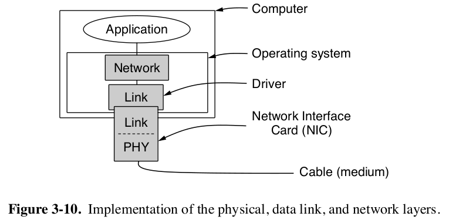
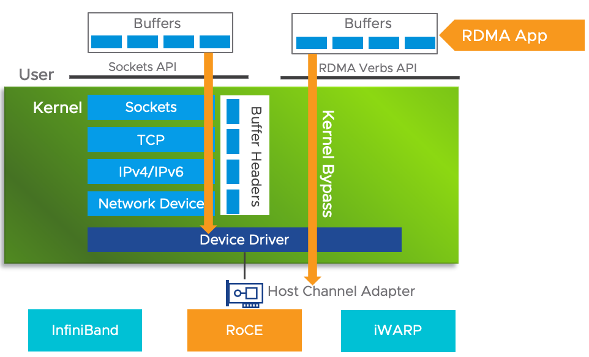
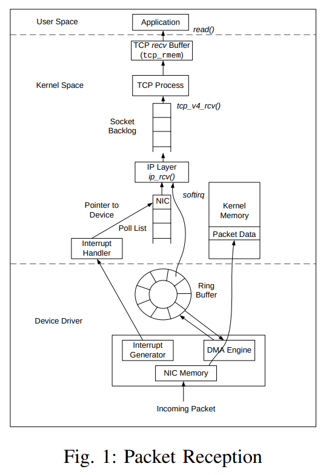

# 1. 雷电网桥

# 2. InfiniBand

# 3. 网卡(NIC)

对于OSI参考模型中的物理层和链路层，在实际实现是放在NIC中，由网卡以及相应的驱动实现的。而在往上的网络层，传输层是放在操作系统内核中，由内核实现的。

## 3.1 网络IO流程

1. 当packet到达NIC时，NIC会唤醒DMA engine，将分组放置在内核内存空间中一个ring buffer中。当这个buffer满了时，分组会被丢弃(丢包)。
2. 当分组在更高的层级被处理时，仍然会存放在这一个buffer中被处理。
3. 当分组被成功处理之后，NIC会引发一个中断，CPU会处理buffer中的每一个分组，并将其传给IP层。
4. IP层处理每一个分组之后，将其传输给更高层(TCP/UDP)。
5. TCP经过一系列复杂的处理之后，将处理后的分组存放在TCP的**recv buffer**中 

## 3.2 网卡队列

# 4. 高性能网络通信技术

## 4.1 RDMA

远程直接内存访问

### 4.1.1 DMA(直接内存访问)

### 4.1.2 传统的TCP/IP技术在数据包处理过程

整个TCP/IP协议栈都需要由CPU维护。

### 4.1.3 RDMA处理过程

网卡代替CPU。需要网卡能够支持RDMA协议，**RNIC**。

### 4.1.4 RDMA的实现

## 4.2 eBPF

## 4.3 巨型帧

# 5. Linux TCP/IP协议栈的实现

参考[TCP Implementation in Linux: A Brief Tutorial](https://sn0rt.github.io/media/paper/TCPlinux.pdf)

## 5.1 Linux TCP/IP协议栈的性能瓶颈

[Potential Performance Bottleneck in Linux TCP](https://digital.library.unt.edu/ark:/67531/metadc888303/m2/1/high_res_d/897196.pdf)

# 6. NTP协议与时钟服务器