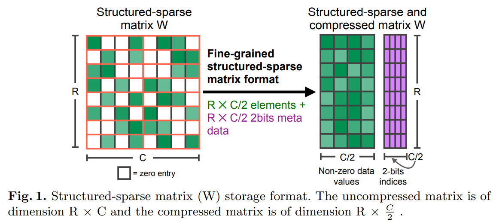
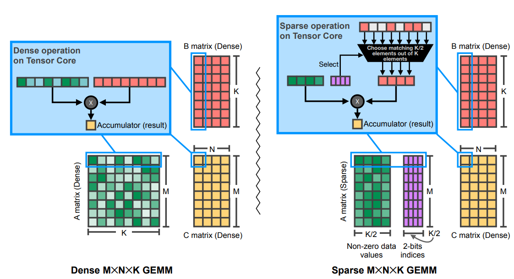
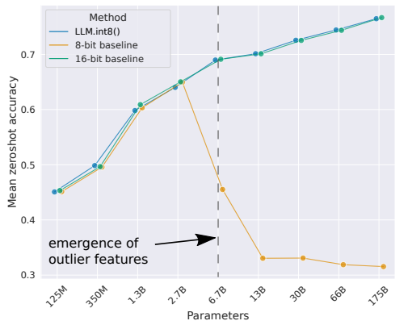
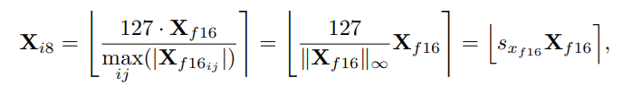

# Accelerating Sparse Deep Neural Networks

existing pruning methods can struggle to simultaneously maintain model accuracy and gain inference performance：

1. ```
   Fine-grained sparsity maintains accuracy but poorly utilizes memory accesses and fails to take advantage of modern vector and matrix math pipelines, thus it does not outperform traditional dense models on processor architectures such as GPUs
   ```

2. ```
   Coarse-grained sparsity can better utilize processor resources but fails to maintain accuracy beyond moderate sparsity ratios.
   ```


2:4 sparsity pattern


剪枝的方法可以分为：

1. train and prune a dense model, then fine-tune the remaining weights in the model to recover accuracy
2. train a dense model with gradual pruning to obtain a sparse model
3. train a sparse model with a sparsity pattern selected a priori
4.  train a sparse model with a sparsity pattern determined based on trained dense version


第一种方法又可以细分为以下几个部分：

1. pruning method
   - weight magnitude based metrics
   - salience-based criteria
2. pruning schedule
   - single step
   - gradual/iterative
3. sparsity structure
   - structured
   - unstructured
4. fine-tuning schedule 不同的网络有不同的fine-tuning schedule


NVIDIA Ampere架构对于2:4 sparsity有很好的支持。




CSR/CSC/COO storage formats，是几种存储稀疏矩阵的数据结构，非结构化稀疏一般都使用着几种方式存储稀疏矩阵，但是这几种稀疏矩阵格式会导致data-dependent accesses，**thereby increasing latency for matrix reads**





# LLM.int8(): 8-bit Matrix Multiplication for Transformers at Scale

Int8 matrix multiplication for feed-forward and attention projection layers in transformers


LLM.int8()是一个两阶段过程：

1. vector-wise quantization
2. for the **emergent outliers(离群值)**，a new mixed-precision decomposition scheme


feed-forward和attention projection layers量化成8bit。


outlier features


vector-wise quantization


6.7B是一个分水岭







# DynamicVIT

