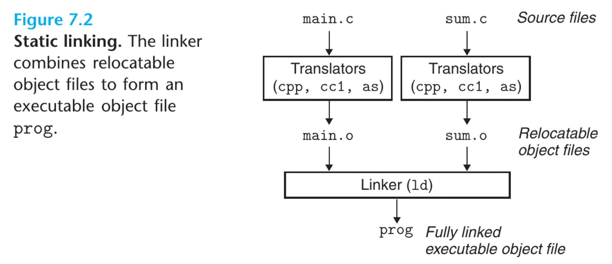

# 链接Linker


# 首先是CSAPP上链接这一章（第七章）

首先一个程序有着三个阶段


## 7.1 Compiler driver

**Compiler driver**可以理解为一个前端，集成了编译过程中的所需要的所有的组件：

- **Preprocessor**
- **Compiler**
- **Assembler**
- **Linker**ompiler driver会自动地调用这些工具，配置好相应的参数，自动完成整个Compiler pipeline。

Compiler driver也可以被叫做Compiler front end，编译器前端。

常用的Compiler driver有：

- **GCC**

  

- **Clang**

- **NVCC**


## 7.2 Static Linking

Linker有两个主要的任务：

- **Symbol Resolution**：Object
- **Relocation**


## 7.3 Object Files

这里的分类有不同的说法

CSAPP以及一些其它资料按以下方式分类，Object File有三种格式：

- **Relocatable object file**
- **Executable object file**
- **Shared object file**

而Wiki中的分类不太相同，个人认为更加合理，将Object/Executable两种文件分开来

```
The object code is usually relocatable, and not usually directly executable
```

- **Object file**
  - **Relocatable file**
  - **Shared object**
- **Executable file**


## 7.4 Relocatable Object Files

这里涉及到[ELF file format](https://en.wikipedia.org/wiki/Executable_and_Linkable_Format)


# ELF File Format

主要资料来源：

- [TIS ELF Specification]()
- [ELF file format](https://en.wikipedia.org/wiki/Executable_and_Linkable_Format)

ELF


